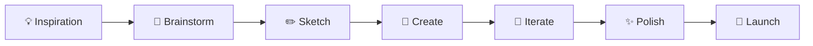

# 🎨 Creative Emoji Collection

Une collection complète d'emojis créatifs pour donner vie à vos README GitHub ! Parfait pour les profils d'artistes, designers, créateurs de contenu, game developers et tous les créatifs.

---

## 🎮 Gaming & Game Development

### 🕹️ Gaming Général
```markdown
🎮 Gaming          🕹️ Retro Gaming    🎯 Competitive     🏆 Esports
🎪 Streaming       🎬 Game Recording  📺 Broadcasting    🎵 Game Audio
🎨 Game Art        🖌️ Pixel Art       🎭 Character Design 🗺️ Level Design
⚔️ Action          🧩 Puzzle          🏃‍♂️ Platformer     🏎️ Racing
👾 Arcade          🎲 Board Games     🃏 Card Games      🧠 Strategy
```

### 🎯 Game Development
```markdown
🔧 Game Engine     🎮 Unity           🔥 Unreal Engine  🎯 Godot
🎨 Asset Creation  🖼️ Sprite Work     🎬 Animation       🎵 Sound Design
🗒️ Game Design     📝 Narrative       🎭 Storytelling    🗺️ World Building
⚡ Performance     🐛 Bug Fixing      🔍 Testing         📊 Analytics
🚀 Publishing      📱 Mobile Games    💻 PC Gaming       🎪 VR/AR
```

### 🏆 Gaming Culture
```markdown
🎊 Game Jam        🎉 Game Launch     🥇 First Place     🏅 Achievement
📈 High Score      💎 Rare Drop       🎁 Loot Box        💰 Microtransaction
👥 Multiplayer     🤝 Co-op           ⚔️ PvP             🌐 Online
📺 Twitch          🎥 YouTube Gaming  🎪 Content Creator 👑 Influencer
```

---

## 🎨 Art & Design

### 🖌️ Arts Visuels
```markdown
🎨 Art             🖌️ Painting        ✏️ Drawing         🖍️ Sketching
🖼️ Digital Art     📱 Mobile Art      💻 Desktop Art     🎭 3D Art
📷 Photography     📸 Portrait        🌅 Landscape       🏙️ Urban
🎬 Video Art       🎞️ Animation       🎪 Motion Graphics 📺 Visual Effects
🎨 Color Theory    🌈 Palette         🎯 Composition     ✨ Effects
```

### 🎨 Design Disciplines
```markdown
🎨 UI Design       📱 UX Design       🖥️ Web Design      📄 Graphic Design
🏢 Brand Design    📦 Package Design  👔 Fashion Design  🏠 Interior Design
📖 Editorial       🎪 Logo Design     🎭 Illustration    🖼️ Icon Design
🎨 Print Design    📺 Digital Design  🎯 Marketing Design 📊 Infographic
```

### 🛠️ Design Tools
```markdown
🎨 Figma           ✨ Adobe Creative  🖌️ Photoshop       🎯 Illustrator
🎬 After Effects   🎞️ Premiere Pro    🎪 Sketch          📐 InDesign
🖼️ Canva           🎨 Procreate       ✏️ Fresco          🎭 Blender
📊 Miro            🗒️ FigJam          🎯 Principle       ⚡ Framer
```

---

## 🎵 Musique & Audio

### 🎶 Création Musicale
```markdown
🎵 Music           🎶 Composition     🎹 Piano           🎸 Guitar
🥁 Drums           🎺 Brass           🎻 Strings         🎤 Vocals
🎧 Audio Production 🎚️ Mixing         🎛️ Mastering       📻 Broadcasting
🎼 Sheet Music     🎵 Notation        🎯 Theory          🎨 Sound Design
```

### 🎧 Audio Tools
```markdown
🎧 Pro Tools       🎚️ Logic Pro      🎛️ Ableton Live   🎵 FL Studio
🎶 Reaper          🔊 Audacity       🎤 GarageBand      📻 Podcast
🎵 Spotify         🎶 SoundCloud     🎧 Apple Music     📻 Radio
🎪 Live Stream     🎬 Audio Video    🎯 Audio Editing   ⚡ Real-time
```

### 🎭 Performance
```markdown
🎤 Live Music      🎪 Concert         🎭 Performance     🎯 Stage
🎊 Festival        🎉 Event           🏆 Award Show      📺 Television
🎬 Music Video     📱 TikTok Music    🎵 Social Media    🌐 Online
```

---

## 🎬 Vidéo & Cinéma

### 🎥 Production Vidéo
```markdown
🎬 Filmmaking      🎥 Cinematography  📹 Video Recording 🎞️ Film
🎪 Direction       🎭 Acting          🎯 Screenplay      📝 Writing
🎨 Production Design 🎭 Costume Design 💄 Makeup          🎵 Film Score
⚡ Editing          🎚️ Color Grading   🔊 Sound Mixing    📊 Post-Production
```

### 📺 Formats & Genres
```markdown
🎬 Movies          📺 TV Shows        🎪 Web Series      📱 Short Form
🎭 Drama           😂 Comedy          🎯 Action          👻 Horror
🚀 Sci-Fi          💘 Romance         📚 Documentary     🎪 Animation
🎮 Gaming Content  🎤 Tutorials       📈 Business        🍳 Lifestyle
```

### 🛠️ Outils Vidéo
```markdown
🎬 Premiere Pro    🎞️ Final Cut Pro   🎪 DaVinci Resolve ⚡ Avid
🎨 After Effects   🎯 Cinema 4D       🎭 Blender         📊 Motion
📱 Mobile Editing  🎥 Camera Work     🎤 Audio Recording 💻 Streaming
```

---

## ✍️ Écriture & Contenu

### 📝 Types d'Écriture
```markdown
✍️ Writing         📖 Novel           📄 Article         📝 Blog
📰 Journalism      🎭 Screenwriting   🎪 Poetry          📚 Non-fiction
📖 E-book          📝 Newsletter      📊 Technical Writing 🎯 Copywriting
📱 Social Media    🎬 Script Writing  🎪 Creative Writing 📈 Content Strategy
```

### 📚 Publications
```markdown
📖 Book            📰 Magazine        📄 Website         📱 App Content
📺 Video Script    🎤 Podcast Script  📊 Presentation    🎯 Marketing Copy
📝 Documentation   📚 Tutorial        🎪 Story           🎭 Narrative
```

### 🖊️ Outils d'Écriture
```markdown
📝 Medium          ✍️ Substack        📖 Notion          📄 Google Docs
🖊️ Grammarly       📝 Hemingway       🎯 Scrivener       📚 Ulysses
📱 Bear            📝 Obsidian        🎪 Draft           ⚡ Quick Notes
```

---

## 🎪 Divertissement & Spectacle

### 🎭 Arts du Spectacle
```markdown
🎭 Theater         🎪 Circus          🎨 Performance Art 🎵 Musical
💃 Dance           🎤 Stand-up        🎯 Magic Show      🎊 Variety Show
🎉 Event Planning  🎪 Entertainment   🎭 Live Performance 📺 Broadcasting
```

### 🎊 Événements
```markdown
🎉 Party           🎊 Celebration     🎪 Festival        🏆 Awards
🎯 Convention      📺 Conference      🎭 Workshop        🎨 Exhibition
🎵 Concert         🎪 Show            🎬 Premiere        🚀 Launch Event
```

### 🎮 Divertissement Digital
```markdown
📱 Mobile Games    💻 PC Gaming       🎮 Console         🕹️ Retro
🎪 Streaming       📺 YouTube         🎵 TikTok          📸 Instagram
🎬 Netflix         🎵 Spotify         🎪 Twitch          📱 Social Media
```

---

## 🚀 Innovation & Créativité

### 💡 Processus Créatif
```markdown
💡 Idea            🧠 Brainstorm      🎯 Concept         ✨ Inspiration
🎨 Creation        🔄 Iteration       🎪 Experimentation 🚀 Innovation
🎭 Imagination     🌟 Vision          💫 Dream           🎊 Magic
⚡ Breakthrough    🔥 Passion         💎 Masterpiece     🏆 Excellence
```

### 🎯 Méthodes Créatives
```markdown
🎨 Design Thinking 🧩 Problem Solving 🎪 Lateral Thinking 🎯 Focus
🔄 Agile Creative  ⚡ Rapid Prototype 🎭 Role Playing     🌈 Color Thinking
🎊 Gamification    🎪 Storytelling    🎯 User Journey     💡 Innovation Lab
```

### 🌟 Inspiration
```markdown
🌟 Trend           🎨 Style           🎪 Movement        📈 Growth
🔥 Hot Topic       ⚡ Viral           🎯 Niche           💎 Unique
🌈 Diverse         🎭 Authentic       ✨ Original        🚀 Cutting Edge
```

---

## 🎨 Palettes d'Emojis par Thème

### 🌈 Arc-en-ciel Créatif
```markdown
🔴 🟠 🟡 🟢 🔵 🟣 ⚫ ⚪ 🟤 🔘
🎨 ✨ 🌟 💫 ⭐ 🌈 🎪 🎭 🎊 🎉
```

### 🎯 Focus & Action
```markdown
🎯 ⚡ 🔥 💥 ⭐ 🚀 💫 ⚔️ 🏆 👑
```

### 💎 Luxe & Premium
```markdown
💎 👑 🏆 ⭐ ✨ 🌟 💫 🥇 🏅 🎖️
```

### 🎪 Fun & Festif
```markdown
🎪 🎉 🎊 🎈 🎁 🎂 🎭 🎨 🎵 🎶
```

---

## 📋 Templates Prêts à l'Emploi

### 🎨 Section "Projets Créatifs"
```markdown
## 🎨 Projets Créatifs

### 🎮 Gaming
- 🎯 **Nom du Jeu** - Description du projet
  - 🎨 Art Direction • 🎵 Sound Design • 🎪 Level Design
  - `Unity` `C#` `Blender`

### 🎬 Vidéo
- 🎞️ **Série Web** - Court métrage animé
  - 🎭 Scénario • 🎨 Animation • 🎵 Musique Originale
  - `After Effects` `Premiere Pro` `Audition`

### 🎨 Design
- 💎 **Brand Identity** - Identité visuelle complète
  - 🎪 Logo • 🌈 Palette • 📦 Packaging
  - `Figma` `Illustrator` `Photoshop`
```

### 🛠️ Section "Outils Créatifs"
```markdown
## 🛠️ Ma Boîte à Outils Créative

### 🎨 Design
🎯 Figma • ✨ Adobe CC • 🖌️ Procreate • 📐 Principle

### 🎬 Vidéo
🎞️ Premiere Pro • 🎨 After Effects • 🎪 DaVinci Resolve

### 🎵 Audio
🎧 Logic Pro • 🎚️ Pro Tools • 🎛️ Ableton Live

### 🎮 Game Dev
🎯 Unity • 🔥 Unreal • 🎨 Blender • 🎪 Maya
```

### 🎯 Section "Processus Créatif"
```markdown
## 🎯 Mon Processus Créatif



🎨 **Inspiration** → 🧠 **Idéation** → ✏️ **Prototypage** → 🎯 **Réalisation** → ✨ **Finalisation**
```

---

## 🎊 Conseils d'Usage Créatif

### ✨ Créer de l'Impact
- **Cohérence visuelle** : Gardez une palette d'emojis harmonieuse
- **Storytelling** : Utilisez les emojis pour raconter votre parcours créatif
- **Personnalité** : Reflétez votre style artistique dans le choix des emojis

### 🎯 Adaptation par Domaine

**🎮 Game Developer**
```markdown
🎮 🕹️ 🎯 ⚔️ 🏆 🎨 🎵 ⚡ 🚀 💎
```

**🎨 Designer**
```markdown
🎨 ✨ 🌈 💎 🎯 ⚡ 🖌️ 📐 💡 🎪
```

**🎬 Créateur Vidéo**
```markdown
🎬 🎞️ 📹 🎭 ⚡ 🎨 🎵 📺 🚀 ✨
```

**🎵 Musicien**
```markdown
🎵 🎶 🎹 🎸 🎤 🎧 ⚡ 🎯 🔥 ✨
```

---

## 🚀 Tendances & Nouveautés

### 🔥 Emojis Tendance 2025
```markdown
🎪 🎭 💫 ⚡ 🔥 💎 🌟 ✨ 🚀 🎯
```

### 🌈 Combinaisons Populaires
```markdown
🎨✨ Art Magique      🎮⚔️ Action Gaming    🎬🎞️ Cinéma
🎵🎧 Audio Pro       🎯🚀 Innovation      💎👑 Premium
🎪🎊 Festivité       ⚡🔥 Énergie         🌟💫 Inspiration
```

**Dernière mise à jour :** Juin 2025 🚀