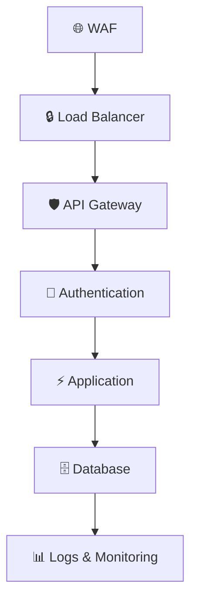
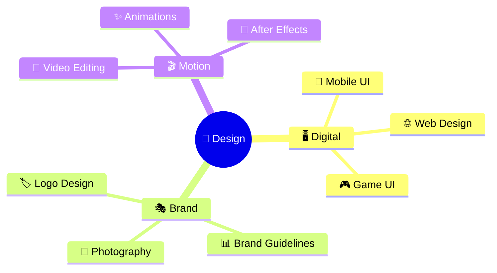
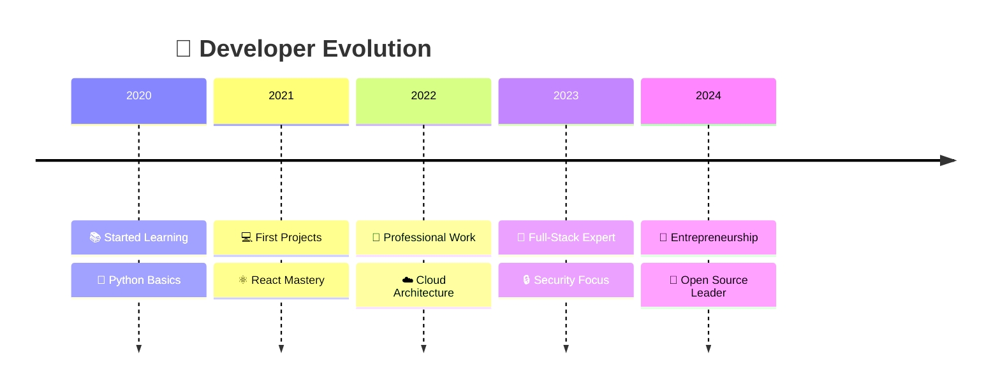
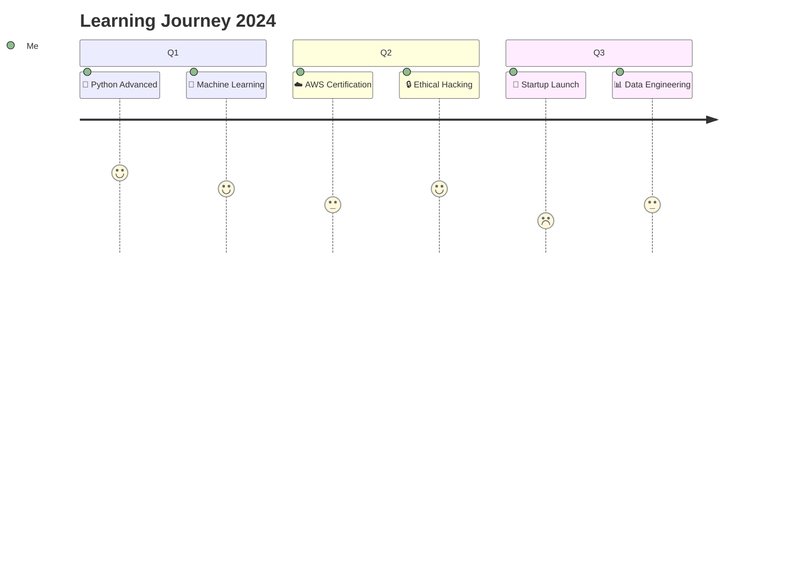
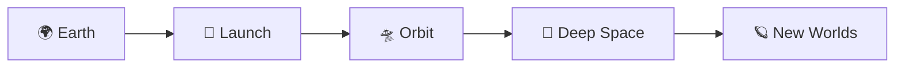
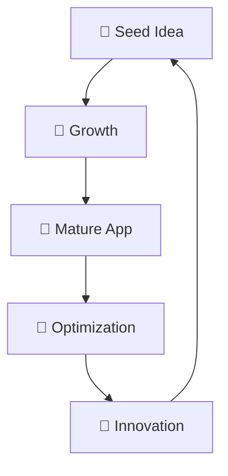

# 🎨 Guide des Combinaisons d'Icônes

Un guide complet pour créer des combinaisons d'icônes harmonieuses et efficaces dans vos README GitHub.

---

## 📚 Table des Matières

- [🎯 Principes de Base](#-principes-de-base)
- [🔧 Combinaisons Techniques](#-combinaisons-techniques)
- [💼 Combinaisons Professionnelles](#-combinaisons-professionnelles)
- [🎨 Combinaisons Créatives](#-combinaisons-créatives)
- [📊 Headers & Sections](#-headers--sections)
- [🚀 Call-to-Actions](#-call-to-actions)
- [📈 Progressions & Niveaux](#-progressions--niveaux)
- [🎭 Thèmes Complets](#-thèmes-complets)

---

## 🎯 Principes de Base

### ✅ Règles d'Or
1. **Cohérence** : Même style visuel dans tout le README
2. **Contraste** : Équilibrer icônes colorées et neutres
3. **Hiérarchie** : Taille et importance décroissantes
4. **Lisibilité** : Toujours privilégier la compréhension

### 🎨 Palettes Harmonieuses

#### Palette Tech Moderne
```markdown
🔵 🟢 🟠 ⚪ ⚫
💙 💚 🧡 🤍 🖤
```

#### Palette Cybersécurité
```markdown
🔴 🟡 🔵 ⚫ ⚪
🛡️ ⚠️ 🔒 🖤 🤍
```

#### Palette Creative
```markdown
🟣 🔵 🟢 🟡 🟠
💜 💙 💚 💛 🧡
```

---

## 🔧 Combinaisons Techniques

### 💻 Stack Full-Stack
```markdown
## 🚀 Ma Stack Technique

### 🎨 Frontend
⚛️ React • 🎭 Vue.js • 🅰️ Angular • ⏭️ Next.js • 🎨 Tailwind CSS

### ⚙️ Backend  
🟢 Node.js • 🐍 Python • ☕ Java • 🔷 TypeScript • 🌶️ Express

### 🗄️ Données
🐘 PostgreSQL • 🍃 MongoDB • 🔥 Redis • 📊 GraphQL

### ☁️ Infrastructure
🐳 Docker • ☸️ Kubernetes • ☁️ AWS • 🔧 Jenkins • 📊 Monitoring
```

### 🛠️ DevOps Pipeline
```markdown
## 🔄 Pipeline DevOps

📝 Code → 🔧 Build → 🧪 Test → 🚀 Deploy → 📊 Monitor

### Étapes Détaillées
1. **📝 Développement** : Git • VS Code • ESLint
2. **🔧 Build & CI** : GitHub Actions • Docker • Webpack
3. **🧪 Tests** : Jest • Cypress • SonarQube  
4. **🚀 Déploiement** : Kubernetes • AWS • Terraform
5. **📊 Monitoring** : Grafana • Prometheus • ELK Stack
```

### 🔒 Sécurité Layers
```markdown
## 🛡️ Architecture Sécurisée



**Couches de Protection :**
- 🌐 **Réseau** : Firewall • DDoS Protection • VPN
- 🔒 **Application** : HTTPS • OWASP • Input Validation  
- 🔐 **Authentification** : OAuth2 • JWT • MFA
- 🗄️ **Données** : Encryption • Backup • Access Control
```

---

## 💼 Combinaisons Professionnelles

### 👔 Profil Consultant
```markdown
## 🎯 Services de Consulting

| 💡 Strategy | 🚀 Implementation | 📊 Optimization |
|:---:|:---:|:---:|
| 🔍 Audit technique | ⚡ Développement | 📈 Performance |
| 📋 Roadmap produit | 🏗️ Architecture | 🔧 Maintenance |
| 💰 ROI Analysis | 👥 Team Building | 📊 Analytics |

### 🏆 Expertise

**🔒 Cybersécurité**
- 🎯 Penetration Testing
- 🛡️ Security Audits  
- 🔐 Compliance (GDPR, SOC2)

**☁️ Cloud Architecture**
- 🏗️ Multi-cloud Strategy
- 📊 Cost Optimization
- 🔄 Migration Planning
```

### 💼 Profil Freelance
```markdown
## 💪 Mes Compétences

### 🎨 Design & UX
🎭 UI Design • 📱 Mobile First • 🎯 User Research • ♿ Accessibility

### 💻 Développement
⚛️ React/Next.js • 🟢 Node.js • 🐘 PostgreSQL • 🐳 Docker

### 🚀 Livraison
⚡ Performance • 🔧 Maintenance • 📊 Analytics • 🛡️ Security

## 📈 Process de Travail

1. **🔍 Découverte** : Analyse besoins • Benchmark • Estimation
2. **🎨 Design** : Wireframes • Prototypes • Tests utilisateurs  
3. **💻 Développement** : Agile • Code Review • Tests automatisés
4. **🚀 Lancement** : Déploiement • Formation • Support
5. **📊 Suivi** : Métriques • Optimisations • Évolutions
```

---

## 🎨 Combinaisons Créatives

### 🎮 Profil Game Developer
```markdown
## 🕹️ Univers Gaming

### 🎮 Mes Créations
| 🏰 **Fantasy RPG** | 🚀 **Space Shooter** | 🧩 **Puzzle Indie** |
|:---:|:---:|:---:|
| ⚔️ Combat system | 🛸 Physics engine | 🧠 AI algorithms |
| 🎭 Character design | ✨ Particle effects | 🎵 Procedural music |
| 🗺️ World building | 🎯 Multiplayer | 📱 Mobile optimization |

### 🛠️ Game Tech Stack
**🎮 Engines :** Unity • Unreal • Godot • Custom C++
**🎨 Art :** Blender • Photoshop • Substance • Aseprite  
**🎵 Audio :** FMOD • Wwise • Audacity • FL Studio
**🔧 Tools :** Git LFS • Perforce • Jenkins • Steam SDK

### 🏆 Achievements Unlocked
- 🥇 **10K+ Downloads** sur Steam
- 🎖️ **Indie Game Award** 2024
- 🌟 **4.8/5 Stars** moyenne utilisateurs
- 🚀 **Featured** sur App Store
```

### 🎨 Profil Creative Designer
```markdown
## ✨ Portfolio Créatif

### 🎨 Domaines d'Expertise



### 🏆 Projets Marquants
- 🌟 **Rebranding Startup** : +300% engagement social
- 🚀 **App Mobile** : Winner Design Awards 2024  
- 🎬 **Motion Design** : 1M+ vues sur YouTube
- 📱 **UI/UX Audit** : +150% conversion rate

### 🛠️ Creative Toolkit
**🎨 Design :** Figma • Adobe CC • Sketch • Framer
**🎬 Video :** Premiere • After Effects • DaVinci • Luma
**📊 Strategy :** Miro • Notion • Analytics • A/B Testing
```

---

## 📊 Headers & Sections

### 🎯 Headers Impactants
```markdown
# 👋 Salut, moi c'est [Nom] !
## 🚀 Développeur Full-Stack & Innovateur
### 💡 Transformant les idées en solutions digitales

# 🛡️ Cybersecurity Expert
## 🔒 Protecting Digital Assets • 🎯 Ethical Hacking
### 🏆 CISSP Certified • 🎖️ Bug Bounty Hunter

# 🎨 Creative Developer  
## ✨ Design Meets Code • 🚀 Digital Experiences
### 🎭 UI/UX • 💻 Frontend • 🎮 Interactive
```

### 📋 Sections Structurées
```markdown
## 🎯 About Me
## 🛠️ Tech Stack  
## 🚀 Current Projects
## 📈 GitHub Stats
## 🏆 Achievements
## 📚 Learning Path
## 💬 Let's Connect
## ⭐ Support My Work
```

### 🔄 Sections avec Flux
```markdown
## 🎯 My Journey


```

---

## 🚀 Call-to-Actions

### 💼 Professionnel
```markdown
## 🤝 Travaillons Ensemble !

### 🎯 Besoin d'aide pour :
- 🚀 **Développer** une application moderne ?
- 🔒 **Sécuriser** votre infrastructure ?  
- ☁️ **Migrer** vers le cloud ?
- 📊 **Optimiser** vos performances ?

### 📞 Contactez-moi maintenant !

[](mailto:contact@example.com)
[](https://linkedin.com/in/profile)
[](https://portfolio.com)

> 💡 **Réponse garantie sous 24h** • 🎯 **Devis gratuit** • 🏆 **Satisfaction client : 100%**
```

### 🎨 Créatif
```markdown
## ✨ Créons Quelque Chose d'Incroyable !

### 🎭 Projets qui m'passionnent :
- 🎮 **Jeux Innovants** avec mécaniques uniques
- 🎨 **Expériences Immersives** en VR/AR
- 🤖 **IA Créative** pour l'art génératif
- 🌟 **Installations Interactives** pour événements

### 🚀 Prêt à révolutionner votre projet ?

[](https://portfolio.com)
[](https://discord.com/user)
[](https://instagram.com/profile)

> 🎯 **Collaboration créative** • ✨ **Prototypage rapide** • 🏆 **Innovation garantie**
```

---

## 📈 Progressions & Niveaux

### 🎓 Learning Path
```markdown
## 📚 Mon Parcours d'Apprentissage

### 🚀 Actuellement en cours


**Progress Bars :**
- 🐍 **Python** ████████████████████ 95%
- ⚛️ **React** ██████████████████░░ 90%  
- ☁️ **AWS** ████████████░░░░░░░░ 70%
- 🔒 **Security** ██████████████░░░░░░ 75%
- 🤖 **AI/ML** ████████░░░░░░░░░░░░ 40%
```

### 🏆 Skill Levels
```markdown
## 💪 Niveau de Compétences

### 🚀 Expert (5+ ans)
🐍 Python • ⚛️ React • 🟢 Node.js • 🐳 Docker • ☁️ AWS

### 🔥 Avancé (3-5 ans)  
🔷 TypeScript • 🔒 Security • 📊 Data Analysis • 🤖 AI/ML

### ⚡ Intermédiaire (1-3 ans)
☸️ Kubernetes • 🦀 Rust • 📱 Mobile Dev • 🎮 Game Dev

### 🌱 Apprentissage (< 1 an)
🔗 Blockchain • 🧠 Quantum Computing • 🎨 3D Graphics
```

---

## 🎭 Thèmes Complets

### 🌌 Thème Space/Futuriste
```markdown
# 🚀 Welcome to My Digital Galaxy

<div align="center">


🛸 **Exploring the frontiers of technology** 🌌

</div>

## 🌟 Mission Control



### 🛸 Tech Arsenal
- **🚀 Propulsion:** React • Vue.js • Next.js
- **🛰️ Communications:** GraphQL • REST • WebSockets  
- **🌌 Navigation:** Docker • Kubernetes • AWS
- **🔬 Research:** AI/ML • Quantum Computing • IoT

### 🌟 Active Missions
| 🛸 **Project Apollo** | 🪐 **Mars Colony** | 🌌 **Galactic Network** |
|:---:|:---:|:---:|
| Next-gen web platform | VR world building | Distributed systems |
| 🚀 Launch: Q3 2024 | 🔴 Status: Building | 🌟 Phase: Research |
```

### 🌿 Thème Nature/Organique  
```markdown
# 🌱 Growing Digital Solutions

## 🌳 My Development Ecosystem



### 🍃 Organic Tech Stack
- **🌱 Roots (Backend):** 🐍 Python • 🟢 Node.js • 🍃 MongoDB
- **🌿 Stem (APIs):** 🌊 GraphQL • 🔗 REST • ⚡ WebSockets
- **🌳 Branches (Frontend):** ⚛️ React • 🎋 Vue.js • 🍀 Svelte
- **🌸 Flowers (UX):** 🎨 Figma • ✨ Animations • 🦋 Interactions

### 🌺 Seasonal Projects
- **🌸 Spring 2024:** New portfolio bloom
- **☀️ Summer 2024:** Mobile app harvest  
- **🍂 Autumn 2024:** Open source contributions
- **❄️ Winter 2024:** Learning hibernation (AI/ML)
```

### 🎮 Thème Gaming/Retro
```markdown
# 🕹️ Player Profile: [YourName]

```
╔══════════════════════════════════════╗
║  🏆 LEVEL 25 DEVELOPER               ║
║  ⚡ XP: 50,000 / 55,000             ║
║  💎 Rank: Senior Full-Stack         ║
╚══════════════════════════════════════╝
```

## 🎮 Character Stats

| Stat | Level | Progress |
|:---:|:---:|:---|
| 💻 **Coding** | 92 | ████████████████████▒ |
| 🎨 **Design** | 78 | ███████████████▒░░░░░ |
| 🔒 **Security** | 85 | █████████████████░░░░ |
| 👥 **Leadership** | 73 | ██████████████▒░░░░░░ |

## 🛡️ Equipment Loadout
- **⚔️ Primary Weapon:** VS Code + Extensions
- **🛡️ Shield:** Git + Backup Systems
- **🧪 Potions:** Coffee + Documentation
- **🎒 Inventory:** 50+ Repositories

## 🏆 Achievements Unlocked
- 🥇 **First Deployment** (2020)
- 🚀 **10K+ Lines Coded** (2021)  
- 🏅 **Bug Slayer** - Fixed 500+ issues
- 🌟 **Open Source Contributor** - 25+ PRs
- 👑 **Team Leader** - Led 5+ projects
```

---

## 📝 Templates Prêts à l'Emploi

### 🎯 Section "About Me" Complète
```markdown
## 🚀 À propos de moi

🎯 **Développeur Full-Stack passionné** par l'intersection entre **technologie**, **sécurité** et **innovation**. 

### 💫 Ma Philosophy
> 💡 *"Code with purpose, secure by design, innovate without limits"*

**Ce qui me motive :**
- 🔥 Résoudre des problèmes complexes avec des solutions élégantes
- 🌟 Créer des expériences utilisateur exceptionnelles  
- 🔒 Construire des systèmes sécurisés et scalables
- 🚀 Partager mes connaissances avec la communauté

**En dehors du code :**
- 🎮 Game design et modding Minecraft
- 🔐 Veille cybersécurité et ethical hacking
- 📚 Lecture de science-fiction et futurologie
- 🏃‍♂️ Course et randonnée en montagne
```

### 🛠️ Section Tech Stack Modulaire
```markdown
## 🛠️ Arsenal Technologique

<details>
<summary>🎨 <strong>Frontend Development</strong></summary>

| Technologie | Niveau | Projets | Depuis |
|:---:|:---:|:---:|:---:|
| ⚛️ React | 🔥🔥🔥🔥🔥 | 25+ | 2021 |
| 🔷 TypeScript | 🔥🔥🔥🔥░ | 15+ | 2022 |
| ⏭️ Next.js | 🔥🔥🔥🔥░ | 12+ | 2022 |
| 🎨 Tailwind | 🔥🔥🔥🔥🔥 | 20+ | 2021 |

</details>

<details>
<summary>⚙️ <strong>Backend Development</strong></summary>

| Technologie | Niveau | Projets | Depuis |
|:---:|:---:|:---:|:---:|
| 🟢 Node.js | 🔥🔥🔥🔥🔥 | 30+ | 2020 |
| 🐍 Python | 🔥🔥🔥🔥░ | 20+ | 2019 |
| 🌶️ Express | 🔥🔥🔥🔥🔥 | 25+ | 2020 |
| 🏗️ Django | 🔥🔥🔥░░ | 8+ | 2023 |

</details>

<details>
<summary>☁️ <strong>DevOps & Cloud</strong></summary>

| Technologie | Niveau | Projets | Depuis |
|:---:|:---:|:---:|:---:|
| 🐳 Docker | 🔥🔥🔥🔥░ | 15+ | 2022 |
| ☁️ AWS | 🔥🔥🔥░░ | 10+ | 2023 |
| 🔧 Jenkins | 🔥🔥🔥░░ | 5+ | 2024 |
| ☸️ Kubernetes | 🔥🔥░░░ | 3+ | 2024 |

</details>
```

---

## 🎨 Personnalisation Avancée

### 🌈 Variables de Thème
```markdown
<!-- Définir vos couleurs de thème -->
<!-- Primary: #FF6B35 (Orange vif) -->
<!-- Secondary: #004E98 (Bleu profond) -->  
<!-- Accent: #FFD23F (Jaune doré) -->
<!-- Success: #06D001 (Vert électrique) -->
<!-- Warning: #FF9F1C (Orange) -->

<!-- Headers avec couleurs cohérentes -->


<!-- Badges avec palette -->
[]()
[]()
[]()
```

### 🎭 Animations Personnalisées
```markdown
<!-- Animation d'écriture -->
[](https://git.io/typing-svg)

<!-- Graphique animé -->


<!-- Stats avec thème -->

```

---

## ✅ Checklist de Validation

Avant d'utiliser vos combinaisons d'icônes :

### 🎯 Cohérence
- [ ] Style d'emoji uniforme dans tout le README
- [ ] Palette de couleurs respectée  
- [ ] Taille des icônes appropriée au contexte
- [ ] Hiérarchie visuelle claire

### 📱 Accessibilité  
- [ ] Contenu lisible sans les icônes
- [ ] Contrastes suffisants
- [ ] Texte alternatif pour les images
- [ ] Navigation facile sur mobile

### ⚡ Performance
- [ ] Images optimisées (SVG préférés)
- [ ] Chargement rapide des badges externes
- [ ] Pas de surcharge visuelle
- [ ] Compatibilité multi-navigateurs

### 🎨 Impact Visuel
- [ ] Premier regard impactant
- [ ] Sections bien délimitées  
- [ ] Call-to-actions visibles
- [ ] Personnalité qui transpire

---

**💡 Conseil Pro :** Testez toujours vos combinaisons en mode sombre ET clair de GitHub pour assurer une lisibilité optimale ! 🌓