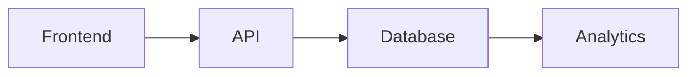
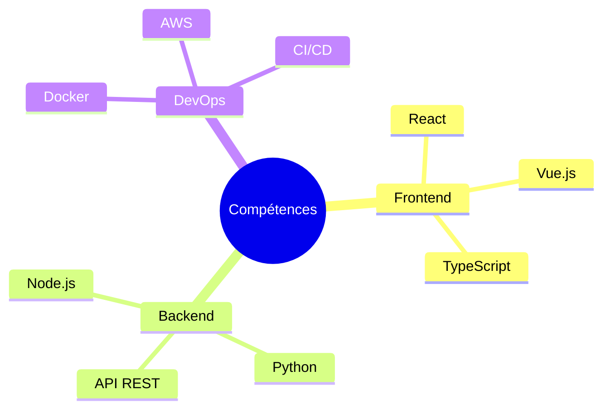
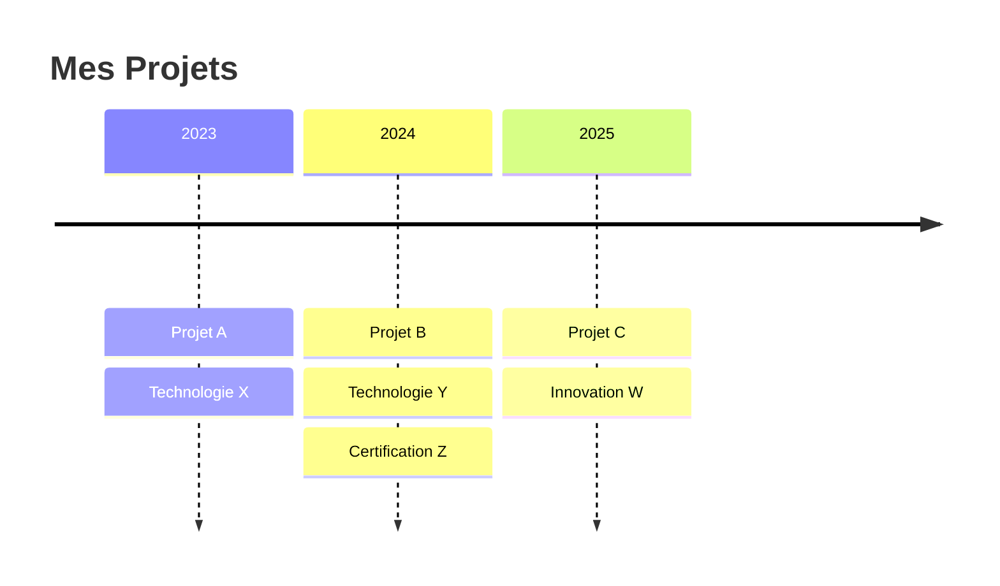

# 🎨 Guide de Personnalisation

<div align="center">


</div>

Ce guide vous accompagne dans la personnalisation de votre template README pour créer un profil GitHub unique et professionnel. Chaque template dispose de ses propres instructions spécifiques dans son dossier dédié.

---

## 📋 Table des Matières

- [🎯 Structure des Templates](#-structure-des-templates)
- [🚀 Démarrage Rapide](#-démarrage-rapide)
- [🎨 Personnalisation de Base](#-personnalisation-de-base)
  - [Informations Personnelles](#informations-personnelles)
  - [Badges et Liens](#badges-et-liens)
  - [Sections Principales](#sections-principales)
- [🔧 Éléments Avancés](#-éléments-avancés)
  - [Headers Animés](#headers-animés)
  - [Statistiques GitHub](#statistiques-github)
  - [Diagrammes Mermaid](#diagrammes-mermaid)
  - [Tableaux et Grilles](#tableaux-et-grilles)
- [🎭 Personnalisation Visuelle](#-personnalisation-visuelle)
  - [Palettes de Couleurs](#palettes-de-couleurs)
  - [Animations et Effets](#animations-et-effets)
  - [Icônes et Emojis](#icônes-et-emojis)
- [📱 Responsive Design](#-responsive-design)
- [🔍 SEO et Accessibilité](#-seo-et-accessibilité)
- [🛠️ Outils Recommandés](#️-outils-recommandés)
- [❓ FAQ](#-faq)
- [🐛 Dépannage](#-dépannage)

---

## 🎯 Structure des Templates

Chaque template de ce repository suit une structure standardisée pour faciliter votre personnalisation :

```
template-name/
├── 📄 README-template.md      # Template vierge à personnaliser
├── 📄 README-example.md       # Exemple complet fonctionnel
├── 📄 customization.md        # Instructions spécifiques au template
```

> 💡 **Important :** Les instructions détaillées pour chaque template se trouvent dans leur fichier `customization.md` respectif. Ce guide général couvre les concepts communs à tous les templates.

---

## 🚀 Démarrage Rapide

### Étape 1 : Choisir votre template
1. Parcourez les [catégories disponibles](../README.md#-templates-disponibles)
2. Consultez les previews pour identifier le style qui vous convient
3. Évaluez le niveau de difficulté selon votre expérience

### Étape 2 : Copier le template
```bash
# Clonez le repository
git clone https://github.com/elieduclr/Awesome-Readme-Templates.git

# Naviguez vers votre template choisi
cd Awesome-Readme-Templates/templates/[categorie]/[template-name]/

# Copiez le template dans votre profil
cp README-template.md ~/votre-username/README.md
```

### Étape 3 : Personnaliser
1. Ouvrez `README-template.md` dans votre éditeur favori
2. Consultez `customization.md` pour les instructions spécifiques
3. Remplacez les placeholders par vos informations
4. Testez le rendu sur GitHub

---

## 🎨 Personnalisation de Base

### Informations Personnelles

#### Placeholders Communs
Recherchez et remplacez les éléments ressemblant dans votre template :

```markdown
[VOTRE_NOM]              → Élie Duclar
[VOTRE_USERNAME]         → elieduclr
[VOTRE_EMAIL]           → elieducailar@gmail.com
[VOTRE_SITE]            → https://elie-dev.vercel.app
[VOTRE_TITRE]           → Développeur Full-Stack
[VOTRE_DESCRIPTION]     → Spécialisé en cybersécurité et innovation
[VOTRE_LOCALISATION]    → Millau, France
```

#### Sections à Personnaliser
- **À propos** : Votre histoire, passions, objectifs
- **Compétences** : Technologies maîtrisées, niveau d'expertise  
- **Projets** : Réalisations, liens démo, descriptions techniques
- **Contact** : Moyens de vous joindre, réseaux sociaux

### Badges et Liens

#### Structure des Badges
```markdown
[](lien)
```

#### Personnalisation des Couleurs
```markdown
# Couleurs hexadécimales
&color=FF5722     # Orange
&color=2196F3     # Bleu  
&color=4CAF50     # Vert
&color=9C27B0     # Violet

# Couleurs nommées
&color=red
&color=blue
&color=green
&color=brightgreen
```

#### Logos Populaires
```markdown
&logo=github          # GitHub
&logo=linkedin        # LinkedIn  
&logo=gmail           # Gmail
&logo=twitter         # Twitter
&logo=discord         # Discord
&logo=react           # React
&logo=python          # Python
&logo=javascript      # JavaScript
```

### Sections Principales

#### Section À Propos - Template
```markdown
## 🚀 À propos de moi

[Description personnelle engageante qui inclut :]
- Votre passion principale
- Votre spécialisation technique  
- Votre approche unique
- Un élément personnel/fun

[Phrase d'accroche sur vos projets actuels ou objectifs]
```

#### Section Compétences - Formats
```markdown
# Format Badges (Recommandé)


# Format Liste Simple
- **Frontend :** React, Vue.js, Angular
- **Backend :** Node.js, Python, PHP  
- **Database :** PostgreSQL, MongoDB
- **DevOps :** Docker, Kubernetes, AWS

# Format Tableau
| Frontend | Backend | DevOps |
|:---:|:---:|:---:|
| React | Node.js | Docker |
| Vue.js | Python | AWS |
```

---

## 🔧 Éléments Avancés

### Headers Animés

#### Capsule Render - Paramètres Principaux
```markdown

&height=300                   # Hauteur en pixels
&section=header               # Position (header/footer)
&text=Votre%20Texte          # Texte principal (URL encoded)
&fontSize=50                  # Taille du texte principal
&fontColor=fff               # Couleur du texte (hex sans #)
&animation=twinkling         # Type d'animation
&fontAlignY=35              # Position verticale du texte
&desc=Votre%20Description   # Texte de description
&descAlignY=55              # Position de la description
&descSize=20                # Taille de la description
)
```

#### Types d'Animation Disponibles
- `fadeIn` - Apparition en fondu
- `scaleIn` - Zoom d'entrée
- `blink` - Clignotement
- `blinking` - Clignotement continu
- `twinkling` - Scintillement
- `fadeIn` - Fondu progressif

#### Types de Rendu
- `wave` - Vague classique
- `waving` - Vague animée
- `cylinder` - Cylindre 3D
- `rounded` - Coins arrondis
- `rect` - Rectangle simple
- `slice` - Découpe diagonale

### Statistiques GitHub

#### GitHub Stats - Configuration
```markdown
# Statistiques générales


# Langages les plus utilisés


# Streak Stats

```

#### Thèmes Populaires
- `default` - Thème GitHub par défaut
- `dark` - Mode sombre
- `tokyonight` - Style Tokyo Night
- `onedark` - One Dark theme
- `cobalt` - Bleu cobalt
- `synthwave` - Style synthwave
- `highcontrast` - Contraste élevé
- `dracula` - Thème Dracula

### Diagrammes Mermaid

#### Graphique de Flux Simple


#### Diagramme de Compétences


#### Timeline de Projets


### Tableaux et Grilles

#### Grille de Projets
```markdown
<div align="center">

| 🎮 **Projet 1** | 💼 **Projet 2** | 🔒 **Projet 3** |
|:---:|:---:|:---:|
| Description courte | Description courte | Description courte |
| `Tech1` `Tech2` | `Tech3` `Tech4` | `Tech5` `Tech6` |
| [Demo](lien) | [Repo](lien) | [Live](lien) |

</div>
```

#### Tableau de Compétences
```markdown
| Catégorie | Technologies | Niveau |
|:---|:---|:---:|
| **Frontend** | React, Vue.js, Angular | ⭐⭐⭐⭐⭐ |
| **Backend** | Node.js, Python, PHP | ⭐⭐⭐⭐ |
| **Mobile** | React Native, Flutter | ⭐⭐⭐ |
| **DevOps** | Docker, Kubernetes, AWS | ⭐⭐⭐⭐ |
```

---

## 🎭 Personnalisation Visuelle

### Palettes de Couleurs

#### Palettes Professionnelles
```markdown
# Bleu Corporate
Primary: #2196F3    Secondary: #1976D2    Accent: #03DAC6

# Rouge Moderne  
Primary: #FF5722    Secondary: #E64A19    Accent: #FFC107

# Vert Tech
Primary: #4CAF50    Secondary: #388E3C    Accent: #00BCD4

# Violet Créatif
Primary: #9C27B0    Secondary: #7B1FA2    Accent: #E91E63
```

#### Application des Couleurs
```markdown
# Dans les badges
&color=2196F3

# Dans les headers
&customColorList=12    # Palette bleue
&customColorList=6     # Palette rouge  
&customColorList=24    # Palette verte
&customColorList=18    # Palette violette
```

### Animations et Effets

#### CSS in Markdown (GitHub Pages)
```html
<div align="center">
  
</div>

<!-- Effet de hover (limité) -->
<kbd>Texte en surbrillance</kbd>

<!-- Centrage avancé -->
<p align="center">
  
</p>
```

### Icônes et Emojis

#### Emojis Techniques
```
🚀 Projets/Launch    🔧 Outils/Tools      🎯 Objectifs/Goals
💻 Code/Dev          🔒 Sécurité/Security  📈 Stats/Growth  
🎨 Design/Creative   🌐 Web/Internet      ⚡ Performance
🤖 AI/Bot           📱 Mobile/App        🔥 Trending
```

#### Emojis par Catégorie
```
Frontend: ⚛️ 🎨 📱 🖥️ 
Backend: ⚙️ 🔧 🗄️ 🌐
DevOps: 🐳 ☁️ 🔄 📊
Security: 🔒 🛡️ 🔐 🎯
Gaming: 🎮 🎲 🏆 ⚔️
```

---

## 📱 Responsive Design

### Images Responsives
```markdown
# Taille fixe pour desktop


# Responsive avec max-width


# Tailles multiples selon écran
<picture>
  <source media="(max-width: 600px)" srcset="mobile.png">
  <source media="(max-width: 1200px)" srcset="tablet.png">  
  
</picture>
```

### Layouts Adaptatifs
```markdown
# Grille qui s'adapte
<div align="center">

| Mobile | Tablet | Desktop |
|:---:|:---:|:---:|
| Single column | Two columns | Three columns |

</div>

# Masquer sur mobile (GitHub Pages uniquement)
<div class="hide-on-mobile">
  Contenu visible uniquement sur desktop
</div>
```

---

## 🔍 SEO et Accessibilité

### Métadonnées
```markdown
<!-- Description du repository -->
Développeur Full-Stack spécialisé en cybersécurité | React, Node.js, Python | Innovation & Gaming

<!-- Tags/Topics recommandés pour le repo -->
Topics: developer, fullstack, cybersecurity, react, nodejs, python, portfolio
```

### Accessibilité
```markdown
# Texte alternatif obligatoire


# Liens descriptifs
[Voir mon portfolio complet](https://elie-dev.vercel.app/)
# ❌ Éviter : [Cliquez ici](lien)

# Contraste suffisant
Vérifiez que vos couleurs respectent WCAG 2.1 (ratio 4.5:1 minimum)

# Structure sémantique
## Titre de section (H2)
### Sous-titre (H3)
#### Détail (H4)
```

### Optimisation GitHub
```markdown
# Mots-clés dans les titres
## 🚀 Développeur Full-Stack | Cybersécurité & Innovation

# Description riche  
Spécialisé dans le développement d'applications web haute performance
et la sécurisation d'infrastructures cloud (AWS, Azure)

# Liens internes
[Voir mes autres projets](#-projets-en-cours)
```

---

## 🛠️ Outils Recommandés

### Éditeurs Markdown
- **[Typora](https://typora.io/)** - Éditeur WYSIWYG
- **[Mark Text](https://marktext.app/)** - Gratuit et open-source  
- **[Obsidian](https://obsidian.md/)** - Avec preview en temps réel
- **VS Code** avec extensions Markdown

### Générateurs de Contenu
- **[Shields.io](https://shields.io/)** - Badges personnalisés
- **[Capsule Render](https://github.com/kyechan99/capsule-render)** - Headers animés
- **[GitHub README Stats](https://github.com/anuraghazra/github-readme-stats)** - Statistiques
- **[Readme Typing SVG](https://readme-typing-svg.herokuapp.com/)** - Texte animé
- **[Profile README Generator](https://rahuldkjain.github.io/gh-profile-readme-generator/)** - Générateur complet

### Validation et Test
- **[Markdown Lint](https://github.com/markdownlint/markdownlint)** - Validation syntaxe
- **[Readme Preview](https://github.com/sivakumar-kailasam/Readme-Previewer)** - Aperçu en temps réel
- **GitHub Preview** - Onglet Preview dans l'éditeur GitHub

### Ressources Visuelles
- **[Unsplash](https://unsplash.com/)** - Images libres de droits
- **[Flaticon](https://www.flaticon.com/)** - Icônes gratuites
- **[Coolors](https://coolors.co/)** - Générateur de palettes
- **[Canva](https://www.canva.com/)** - Création graphique simple

---

## ❓ FAQ

### Comment choisir le bon template ?

**Pour débutants :**
- Choisissez `simple-clean` ou `student-friendly`
- Évitez les templates avec trop d'animations
- Concentrez-vous sur le contenu avant le style

**Pour professionnels :**
- `corporate` pour environnement entreprise
- `freelancer` pour indépendants  
- `consultant` pour services B2B

**Pour créatifs :**
- `designer` avec portfolio visuel
- `game-dev` pour développeurs de jeux
- `artist` pour créateurs de contenu

### Combien de temps pour personnaliser ?

- **Template simple :** 30-60 minutes
- **Template intermédiaire :** 1-2 heures  
- **Template avancé :** 2-4 heures
- **Customisation complète :** 1-2 jours

### Puis-je mélanger plusieurs templates ?

Oui ! Vous pouvez :
- Prendre le header d'un template
- Les badges d'un autre
- La structure d'un troisième

**Conseil :** Gardez une cohérence visuelle (couleurs, style)

### Comment tester le rendu ?

1. **GitHub Preview :** Éditeur en ligne GitHub
2. **VS Code Preview :** Extension Markdown Preview
3. **Outils en ligne :** Markdown Live Preview
4. **Repository test :** Créez un repo de test privé

---

## 🐛 Dépannage

### Problèmes Courants

#### Images qui ne s'affichent pas
```markdown
# ❌ Chemin relatif incorrect


# ✅ URL complète


# ✅ Service externe

```

#### Badges cassés
```markdown  
# ❌ Caractères non encodés


# ✅ URL encoding

# ou  

```

#### Tableaux mal formatés
```markdown
# ❌ Alignement manquant
| Colonne 1 | Colonne 2 |
| Valeur 1 | Valeur 2 |

# ✅ Avec alignement  
| Colonne 1 | Colonne 2 |
|:---|:---|
| Valeur 1 | Valeur 2 |
```

#### Statistiques GitHub vides
```markdown
# Vérifiez :
- Nom d'utilisateur correct
- Repository public
- Pas de caractères spéciaux dans l'URL
- Service github-readme-stats opérationnel
```

### Problèmes de Performance

#### Chargement lent
- Limitez le nombre d'images externes
- Utilisez des services CDN fiables
- Optimisez la taille des images
- Évitez trop d'animations simultanées

#### Rendu différent selon les plateformes
- GitHub a ses propres limitations CSS
- Testez sur plusieurs navigateurs
- Évitez JavaScript/CSS avancé
- Privilégiez les solutions compatibles Markdown

### Support et Aide

Si vous rencontrez des difficultés :

1. **Consultez la documentation** spécifique de votre template
2. **Vérifiez les issues** du repository
3. **Créez une issue** avec captures d'écran
4. **Rejoignez les discussions** communautaires

---

<div align="center">

### 🎉 Votre README personnalisé vous attend !

Maintenant que vous maîtrisez les bases, il est temps de créer votre chef-d'œuvre ! N'oubliez pas de consulter le guide spécifique de votre template choisi dans son dossier `customization.md`.


**Happy coding! 🚀**

</div>