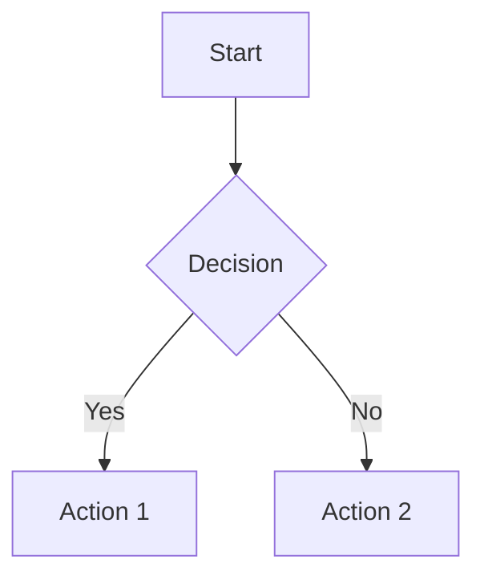

# 🔧 Guide de Résolution de Problèmes

Ce guide vous aidera à résoudre les problèmes les plus courants rencontrés lors de l'utilisation des templates README.md.

---

## 📋 Table des Matières

- [🎨 Problèmes d'Affichage](#-problèmes-daffichage)
  - [Images et Animations](#images-et-animations)
  - [Badges et Shields](#badges-et-shields)
  - [Alignement et Mise en Page](#alignement-et-mise-en-page)
- [📊 Statistiques GitHub](#-statistiques-github)
  - [Stats qui ne s'affichent pas](#stats-qui-ne-saffichent-pas)
  - [Erreurs de nom d'utilisateur](#erreurs-de-nom-dutilisateur)
  - [Thèmes et personnalisation](#thèmes-et-personnalisation)
- [🔗 Liens et Navigation](#-liens-et-navigation)
  - [Liens brisés](#liens-brisés)
  - [Ancres internes](#ancres-internes)
  - [URLs externes](#urls-externes)
- [⚡ Performance et Chargement](#-performance-et-chargement)
  - [Temps de chargement lents](#temps-de-chargement-lents)
  - [Images lourdes](#images-lourdes)
  - [Trop d'éléments externes](#trop-déléments-externes)
- [📱 Compatibilité](#-compatibilité)
  - [Mobile et responsive](#mobile-et-responsive)
  - [Thèmes GitHub (clair/sombre)](#thèmes-github-clairsombre)
  - [Navigateurs](#navigateurs)
- [🛠️ Syntaxe Markdown](#️-syntaxe-markdown)
  - [Erreurs de formatage](#erreurs-de-formatage)
  - [HTML dans Markdown](#html-dans-markdown)
  - [Caractères spéciaux](#caractères-spéciaux)
- [🔍 Diagrammes et Graphiques](#-diagrammes-et-graphiques)
  - [Mermaid ne s'affiche pas](#mermaid-ne-saffiche-pas)
  - [Syntaxe incorrecte](#syntaxe-incorrecte)
- [🚫 Contenu Bloqué](#-contenu-bloqué)
  - [Sécurité GitHub](#sécurité-github)
  - [Contenu externe](#contenu-externe)
- [❓ Questions Fréquentes](#-questions-fréquentes)

---

## 🎨 Problèmes d'Affichage

### Images et Animations

#### ❌ **Problème** : Les images ne s'affichent pas
```markdown

```

#### ✅ **Solution** :
1. **Vérifiez l'URL** : Assurez-vous que le lien est accessible publiquement
2. **Utilisez des URLs complètes** :
   ```markdown
   
   ```
3. **Préférez les services externes fiables** :
   ```markdown
   
   ```

#### ❌ **Problème** : Les animations ne fonctionnent pas
- Les GIFs peuvent être bloqués par certains navigateurs
- Les animations CSS ne fonctionnent pas dans les README GitHub

#### ✅ **Solution** :
- Utilisez des services comme [Capsule Render](https://github.com/kyechan99/capsule-render)
- Testez vos animations sur différents navigateurs
- Fournissez toujours une alternative statique

### Badges et Shields

#### ❌ **Problème** : Badges avec des erreurs 404
```markdown

```

#### ✅ **Solution** :
1. **Encodez correctement les espaces** :
   ```markdown
   
   ```
2. **Utilisez le générateur Shields.io** pour éviter les erreurs
3. **Testez vos badges** avant publication

#### ❌ **Problème** : Badges avec des couleurs incorrectes

#### ✅ **Solution** :
```markdown
<!-- Couleurs prédéfinies -->


<!-- Couleurs personnalisées (hex sans #) -->

```

### Alignement et Mise en Page

#### ❌ **Problème** : Contenu mal aligné

#### ✅ **Solution** :
```markdown
<!-- Centrage avec div -->
<div align="center">
  Contenu centré
</div>

<!-- Tableaux pour alignement complexe -->
<div align="center">

| Gauche | Centre | Droite |
|:---|:---:|---:|
| Contenu | Contenu | Contenu |

</div>
```

---

## 📊 Statistiques GitHub

### Stats qui ne s'affichent pas

#### ❌ **Problème** : Page blanche ou erreur 404

#### ✅ **Solution** :
1. **Vérifiez le nom d'utilisateur** :
   ```markdown
   <!-- Correct -->
   
   
   <!-- Incorrect -->
   
   ```

2. **Profil privé** : Ajoutez `&count_private=true` si nécessaire
3. **Repositories privés** : Utilisez un token personnel si requis

### Erreurs de nom d'utilisateur

#### ❌ **Problème** : "User not found"

#### ✅ **Solution** :
- Vérifiez l'orthographe exacte de votre nom d'utilisateur GitHub
- Respectez la casse (majuscules/minuscules)
- Évitez les espaces ou caractères spéciaux mal encodés

### Thèmes et personnalisation

#### ❌ **Problème** : Thème qui ne s'applique pas

#### ✅ **Solution** :
```markdown
<!-- Thèmes populaires qui fonctionnent -->


```

---

## 🔗 Liens et Navigation

### Liens brisés

#### ❌ **Problème** : Liens qui ne fonctionnent pas
```markdown
[Portfolio](www.monsite.com)  <!-- Incorrect -->
```

#### ✅ **Solution** :
```markdown
[Portfolio](https://www.monsite.com)  <!-- Correct -->
[Email](mailto:email@example.com)     <!-- Correct pour emails -->
```

### Ancres internes

#### ❌ **Problème** : Navigation interne cassée

#### ✅ **Solution** :
```markdown
<!-- Table des matières -->
- [Section 1](#section-1)
- [Section avec espaces](#section-avec-espaces)

## Section 1
Contenu...

## Section avec espaces
Contenu...
```

**Règles pour les ancres :**
- Tout en minuscules
- Espaces remplacés par des tirets
- Caractères spéciaux supprimés
- Émojis ignorés

### URLs externes

#### ❌ **Problème** : Liens externes bloqués

#### ✅ **Solution** :
- Utilisez uniquement des domaines fiables
- Évitez les redirections multiples
- Testez vos liens régulièrement

---

## ⚡ Performance et Chargement

### Temps de chargement lents

#### ❌ **Problème** : README qui met du temps à s'afficher

#### ✅ **Solutions** :
1. **Limitez le nombre d'images externes**
2. **Utilisez des services CDN fiables** :
   - Shields.io pour les badges
   - GitHub pour les images du repo
   - Vercel/Netlify pour les APIs
3. **Évitez les services lents ou peu fiables**

### Images lourdes

#### ❌ **Problème** : Images trop volumineuses

#### ✅ **Solution** :
- Optimisez vos images (format, taille)
- Utilisez des formats web modernes (WebP si supporté)
- Préférez les SVG pour les icônes

### Trop d'éléments externes

#### ❌ **Problème** : Nombreuses requêtes externes

#### ✅ **Solution** :
```markdown
<!-- Au lieu de 10 badges séparés, groupez-les -->

```

---

## 📱 Compatibilité

### Mobile et responsive

#### ❌ **Problème** : Affichage cassé sur mobile

#### ✅ **Solution** :
```markdown
<!-- Évitez les tableaux trop larges -->
<div align="center">

| Tech | Level |
|:---:|:---:|
| React | ⭐⭐⭐ |
| Node | ⭐⭐⭐ |

</div>

<!-- Préférez des listes pour mobile -->
**Langages :** Python • JavaScript • TypeScript
```

### Thèmes GitHub (clair/sombre)

#### ❌ **Problème** : Contenu invisible dans un thème

#### ✅ **Solution** :
```markdown
<!-- Utilisez des couleurs neutres ou testez les deux thèmes -->


<!-- Évitez le blanc sur blanc ou noir sur noir -->
```

### Navigateurs

#### ❌ **Problème** : Affichage différent selon le navigateur

#### ✅ **Solution** :
- Testez sur Chrome, Firefox, Safari
- Utilisez des standards web bien supportés
- Évitez les fonctionnalités expérimentales

---

## 🛠️ Syntaxe Markdown

### Erreurs de formatage

#### ❌ **Problème** : Markdown qui ne s'affiche pas correctement
```markdown
**Gras sans fermeture
*Italique* **dans du gras**  <!-- Imbrication incorrecte -->
```

#### ✅ **Solution** :
```markdown
**Gras correctement fermé**
***Gras et italique***
**Gras** avec *italique* séparé
```

### HTML dans Markdown

#### ❌ **Problème** : HTML non supporté

#### ✅ **Solution** :
```markdown
<!-- HTML autorisé dans GitHub -->
<div align="center">

</div>

<!-- HTML interdit dans GitHub -->
<script>alert('Non supporté')</script>
<style>color: red;</style>
```

### Caractères spéciaux

#### ❌ **Problème** : Caractères qui cassent le formatage

#### ✅ **Solution** :
```markdown
<!-- Échappez les caractères spéciaux -->
\*Texte avec astérisque\*
\[Crochets\]
\\Backslash

<!-- Ou utilisez du code -->
`*Astérisque dans du code*`
```

---

## 🔍 Diagrammes et Graphiques

### Mermaid ne s'affiche pas

#### ❌ **Problème** : Diagramme Mermaid invisible

#### ✅ **Solution** :


**Points importants :**
- Utilisez les blocs code avec `mermaid`
- Respectez la syntaxe exacte
- Testez sur l'éditeur Mermaid en ligne

### Syntaxe incorrecte

#### ❌ **Problème** : Erreur dans la syntaxe Mermaid

#### ✅ **Solution** :
```mermaid
<!-- Correct -->
graph LR
    A --> B
    B --> C

<!-- Incorrect -->
graph LR
    A -> B  <!-- Mauvaise flèche -->
```

---

## 🚫 Contenu Bloqué

### Sécurité GitHub

#### ❌ **Problème** : Contenu bloqué par GitHub

#### ✅ **Solution** :
- Évitez les liens raccourcis (bit.ly, tinyurl)
- Utilisez des domaines de confiance
- Pas de contenu malveillant ou spam

### Contenu externe

#### ❌ **Problème** : API ou service externe inaccessible

#### ✅ **Solution** :
- Utilisez des services avec uptime élevé
- Ayez toujours un plan B (fallback)
- Vérifiez les limites de taux des APIs

---

## ❓ Questions Fréquentes

### Q: Mon README ne s'affiche pas du tout
**R:** Vérifiez que le fichier s'appelle exactement `README.md` (respect de la casse) et qu'il est à la racine de votre repo.

### Q: Les émojis ne s'affichent pas
**R:** GitHub supporte les émojis Unicode et les codes `:emoji:`. Vérifiez la compatibilité de vos émojis.

### Q: Comment tester mon README avant publication ?
**R:** Utilisez l'aperçu GitHub lors de l'édition, ou des outils comme [Markdown Preview](https://markdownlivepreview.com/).

### Q: Puis-je utiliser du CSS personnalisé ?
**R:** Non, GitHub ne permet pas le CSS personnalisé dans les README pour des raisons de sécurité.

### Q: Mes statistiques GitHub ne se mettent pas à jour
**R:** Les stats peuvent avoir un cache de quelques heures. Soyez patient ou ajoutez un paramètre de cache-busting.

### Q: Comment centrer du texte ?
**R:** Utilisez `<div align="center">Texte</div>` ou des tableaux avec alignement central.

### Q: Les badges Shields.io sont lents à charger
**R:** C'est normal, ils sont générés à la demande. Considérez des alternatives pour des besoins critiques.

### Q: Comment déboguer un problème d'affichage ?
**R:** 
1. Vérifiez la syntaxe Markdown
2. Testez les liens externes individuellement
3. Simplifiez progressivement jusqu'à identifier le problème
4. Consultez les outils de développement du navigateur

---

## 🛟 Support Supplémentaire

Si votre problème n'est pas listé ici :

1. **Vérifiez les issues** du repo des templates
2. **Créez une nouvelle issue** avec :
   - Description détaillée du problème
   - Code Markdown concerné
   - Captures d'écran si applicable
   - Navigateur et environnement utilisés

3. **Ressources utiles** :
   - [GitHub Markdown Guide](https://guides.github.com/features/mastering-markdown/)
   - [Shields.io Documentation](https://shields.io/)
   - [Mermaid Documentation](https://mermaid-js.github.io/mermaid/)

---

<div align="center">

**Ce guide a résolu votre problème ? Laissez une ⭐ au projet !**

*Dernière mise à jour : Mai 2025*

</div>