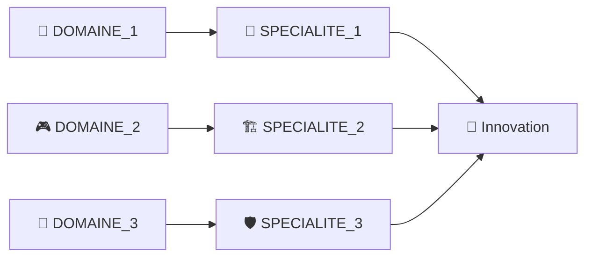

<!-- meta -->
<meta name="keywords" content="MOT_CLE_1, MOT_CLE_2">
<meta name="author" content="[VOTRE_NOM]">

# 👋 Salut, moi c'est [VOTRE_NOM] !

## 🚀 À propos de moi

[DESCRIPTION_PERSONNELLE - Décrivez votre passion, votre approche du développement et de la sécurité. Mentionnez ce qui vous motive et votre vision de la technologie.]

[PHRASE_PERSONNELLE - Ajoutez une touche personnelle sur vos hobbies ou intérêts en dehors du code.] 🎮🔐

---

## 🛠️ Stack Technique

### Langages

<!-- Ajoutez/supprimez les langages selon vos compétences -->

### Frameworks & Librairies

<!-- Personnalisez selon votre stack -->

### DevOps & Cloud

<!-- Adaptez selon votre expérience cloud -->

### Sécurité & Outils

<!-- Ajoutez vos outils de sécurité -->

---

## 🎯 Projets en cours

| 🎮 **[PROJET_1]** | 💼 **[PROJET_2]** | 🔒 **[PROJET_3]** |
|:---:|:---:|:---:|
| [DESCRIPTION_COURTE_PROJET_1] | [DESCRIPTION_COURTE_PROJET_2] | [DESCRIPTION_COURTE_PROJET_3] |
| `[TECH_1]` `[TECH_2]` `[TECH_3]` | `[TECH_1]` `[TECH_2]` `[TECH_3]` | `[TECH_1]` `[TECH_2]` `[TECH_3]` |

### 🌟 Projets récents

- **🎯 [NOM_PROJET]** - [Live Demo]([LIEN_DEMO]) - [DESCRIPTION_DETAILLEE]
    - [FONCTIONNALITE_1]
    - [FONCTIONNALITE_2]
    - [FONCTIONNALITE_3]
    - `[TECH_1]` `[TECH_2]` `[TECH_3]` `[TECH_4]`

<!-- Répétez pour d'autres projets -->

---

## 📈 Statistiques GitHub

---

## 🎓 Apprentissage continu

### 📚 Focus actuel
- **[APPRENTISSAGE_1]** et son impact sur [DOMAINE_APPLICATION]
- **[APPRENTISSAGE_2]** avec un focus sur [SPECIALISATION]
- **[APPRENTISSAGE_3]** appliquée à [CONTEXTE_APPLICATION]
- **[APPRENTISSAGE_4]** pour [OBJECTIF_TECHNIQUE]

---

## 🏆 Expertise

| [DOMAINE_1] | [DOMAINE_2] | [DOMAINE_3] |
|:---:|:---:|:---:|
| 🎯 [COMPETENCE_1] | ⚡ [COMPETENCE_4] | ☁️ [COMPETENCE_7] |
| 🔐 [COMPETENCE_2] | 🎨 [COMPETENCE_5] | 🔄 [COMPETENCE_8] |
| 🛡️ [COMPETENCE_3] | 📱 [COMPETENCE_6] | 🐳 [COMPETENCE_9] |

---

## 💬 Collaborons ensemble !

Je suis toujours ouvert aux **nouvelles opportunités**, aux **projets innovants** et aux **collaborations** qui poussent les limites de la technologie. Que vous ayez besoin d'aide pour :

- 🚀 [SERVICE_1]
- 🔒 [SERVICE_2]
- 🎮 [SERVICE_3]
- 🤖 [SERVICE_4]

N'hésitez pas à me contacter !

### 📫 Restons connectés

---

⭐ **Si mes projets vous intéressent, n'hésitez pas à laisser une étoile !** ⭐

