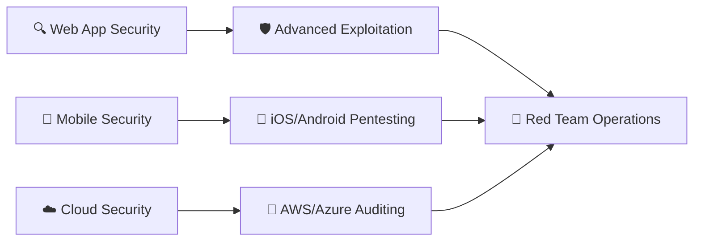
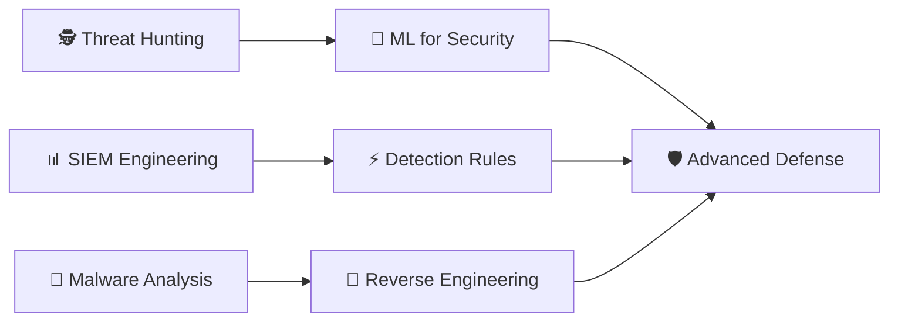

# 🔐 Guide de Personnalisation - Template Cybersécurité

Ce guide vous accompagne étape par étape pour personnaliser le template **Cybersécurité** et créer un profil GitHub professionnel qui reflète votre expertise en sécurité informatique.

---

## 📋 Table des matières

1. [🎨 Personnalisation visuelle](#-personnalisation-visuelle)
2. [📝 Contenu à modifier](#-contenu-à-modifier)
3. [🛠️ Stack technique](#️-stack-technique)
4. [🎯 Projets](#-projets)
5. [📊 Statistiques](#-statistiques)
6. [🎓 Apprentissage](#-apprentissage)
7. [💼 Expertise](#-expertise)
8. [🚀 Conseils avancés](#-conseils-avancés)

---

## 🎨 Personnalisation visuelle

### Header animé

```markdown

```

**Paramètres à personnaliser :**

| Paramètre | Description | Exemples |
|-----------|-------------|----------|
| `text` | Titre principal | `Cyber Security Expert`, `Ethical Hacker`, `Security Consultant` |
| `desc` | Sous-titre | `Pentesting • OSINT • Forensics`, `Red Team • Blue Team` |
| `customColorList` | Palette de couleurs | `0` (purple), `6` (red), `12` (blue), `24` (green) |
| `animation` | Type d'animation | `fadeIn`, `scaleIn`, `blink`, `blinking`, `twinkling` |
| `height` | Hauteur du header | `200`, `250`, `300`, `350` |

### Badges de contact

```markdown
[](VOTRE_PORTFOLIO_URL)
[](mailto:VOTRE_EMAIL)
```

**Badges supplémentaires pour cybersécurité :**

```markdown
[](VOTRE_LINKEDIN)
[](VOTRE_HTB_PROFILE)
[](VOTRE_THM_PROFILE)
[](VOTRE_TWITTER)
```

---

## 📝 Contenu à modifier

### Section "À propos de moi"

**Template actuel :**
```markdown
Passionné par l'intersection entre **technologie**, **sécurité** et **créativité**...
```

**Exemples de personnalisation :**

**Pour un Pentester :**
```markdown
Expert en **tests d'intrusion** et **évaluation de vulnérabilités**, je transforme les failles de sécurité en opportunités d'amélioration. Spécialisé dans l'audit de sécurité d'applications web et d'infrastructures, j'aide les entreprises à renforcer leur posture de sécurité contre les cybermenaces.

Quand je ne "hack" pas éthiquement, vous me trouverez sur HackTheBox ou en train d'analyser les dernières techniques d'attaque ! 🔓🛡️
```

**Pour un Analyste SOC :**
```markdown
Gardien numérique spécialisé dans la **détection de menaces** et **l'analyse d'incidents**, je protège les organisations contre les cyberattaques 24/7. Expert en SIEM, threat hunting et forensics, je transforme les logs en intelligence actionnable pour neutraliser les menaces avant qu'elles n'impactent l'entreprise.

Entre deux alertes, je développe des scripts d'automatisation et je me forme sur les derniers IOCs ! 🕵️‍♂️🚨
```

**Pour un Red Teamer :**
```markdown
Adversaire simulé et **expert en Red Team**, je reproduis les tactiques des cybercriminels pour tester les défenses organisationnelles. Spécialisé dans l'ingénierie sociale, le mouvement latéral et l'exfiltration de données, j'aide les équipes bleues à identifier leurs angles morts de sécurité.

Quand je ne simule pas d'attaques, j'étudie les rapports de threat intelligence et je perfectionne mes techniques OSINT ! 🎭⚔️
```

---

## 🛠️ Stack technique

### Langages spécialisés cybersécurité

Ajoutez ces badges selon votre expertise :

```markdown


```

### Outils de cybersécurité

Remplacez la section "Sécurité & Outils" par :

```markdown
### Outils de cybersécurité


### Systèmes & Environnements


```

---

## 🎯 Projets

### Structure des projets cybersécurité

Remplacez le tableau des projets par :

```markdown
<div align="center">

| 🔍 **VulnScanner** | 🛡️ **SOC Dashboard** | 🎯 **Red Team Toolkit** |
|:---:|:---:|:---:|
| Scanner automatisé de vulnérabilités web | Dashboard temps réel pour monitoring sécurité | Suite d'outils pour tests d'intrusion |
| `Python` `Nmap` `SQLMap` | `ELK Stack` `Grafana` `Python` | `PowerShell` `Metasploit` `Cobalt Strike` |

</div>
```

### Exemples de projets détaillés

**Pour différentes spécialisations :**

**Pentester :**
```markdown
### 🌟 Projets récents

- **🔍 WebVulnScanner** - [GitHub](https://github.com/username/webvulnscanner) - Scanner automatisé pour détection de vulnérabilités OWASP Top 10
    - Détection SQL Injection, XSS, CSRF, LFI/RFI automatisée
    - Intégration avec Burp Suite et OWASP ZAP
    - Génération de rapports PDF détaillés avec preuves de concept
    - `Python` `Requests` `BeautifulSoup` `SQLMap`

- **🎯 PhishingKit Detector** - [Live Demo](https://phishing-detector.com) - Outil de détection de kits de phishing
    - Analyse heuristique de pages web suspectes
    - Base de données de signatures de kits connus
    - API REST pour intégration avec solutions de sécurité
    - `Flask` `Machine Learning` `Threat Intelligence`
```

**Analyste SOC :**
```markdown
### 🌟 Projets récents

- **📊 ThreatHunter Dashboard** - [GitHub](https://github.com/username/threathunter) - Platform de threat hunting avancée
    - Corrélation d'événements multi-sources (SIEM, EDR, Network)
    - Modèles ML pour détection d'anomalies comportementales
    - Playbooks automatisés de réponse aux incidents
    - `ELK Stack` `Python` `Sigma Rules` `MITRE ATT&CK`

- **🚨 IncidentResponse Bot** - [Documentation](https://ir-bot-docs.com) - Bot Slack pour orchestration de réponse aux incidents
    - Intégration avec SOAR et solutions de threat intelligence
    - Workflows automatisés selon la criticité des alertes
    - Notifications temps réel avec enrichissement contextuel
    - `Python` `Slack API` `TheHive` `MISP`
```

---

## 📊 Statistiques

### Statistiques GitHub

Le code actuel fonctionne parfaitement, remplacez juste `elieduclr` par votre username :

```markdown


[](https://git.io/streak-stats)
```

### Statistiques additionnelles pour cybersécurité

Ajoutez après les stats GitHub :

```markdown
### 🏆 Achievements

<div align="center">


**Certifications :**


</div>
```

---

## 🎓 Apprentissage

### Diagramme Mermaid personnalisé

Adaptez le diagramme selon vos intérêts :

**Pour un Pentester :**


**Pour un Analyst SOC :**


### Focus d'apprentissage

Personnalisez selon votre domaine :

**Exemples par spécialisation :**

**Pentester :**
```markdown
### 📚 Focus actuel
- **Advanced Web Exploitation** avec focus sur les bypasses WAF modernes
- **Mobile Application Security** testing iOS et Android
- **Cloud Penetration Testing** sur AWS, Azure et GCP
- **Red Team Tactics** et simulation d'APT avancées
```

**Blue Team :**
```markdown
### 📚 Focus actuel
- **Threat Intelligence** et intégration de feeds IOC/IOA
- **Machine Learning** appliqué à la détection d'anomalies
- **Digital Forensics** et analyse de memory dumps
- **SOAR Implementation** pour automatisation de la réponse aux incidents
```

---

## 💼 Expertise

### Tableau d'expertise cybersécurité

Remplacez le tableau actuel par :

```markdown
<div align="center">

| Offensive Security | Defensive Security | Governance & Risk |
|:---:|:---:|:---:|
| 🎯 Penetration Testing | 🛡️ SOC Operations | 📋 Risk Assessment |
| 🔍 Vulnerability Assessment | 🚨 Incident Response | 📊 Compliance Auditing |
| 🕵️ OSINT & Reconnaissance | 🔬 Malware Analysis | 📝 Security Policies |
| 🎭 Social Engineering | 🕵️‍♂️ Threat Hunting | 🎓 Security Training |

</div>
```

**Ou version spécialisée selon votre profil :**

**Red Team :**
```markdown
| Red Team Operations | Technical Skills | Soft Skills |
|:---:|:---:|:---:|
| 🎯 Initial Access | 💻 Custom Malware Dev | 🎭 Social Engineering |
| 🔄 Lateral Movement | 🛠️ Tool Development | 📊 Report Writing |
| 👤 Privilege Escalation | 🔍 OSINT Techniques | 🗣️ Client Communication |
| 📤 Data Exfiltration | 🔐 Evasion Techniques | 👥 Team Leadership |
```

---

## 🚀 Conseils avancés

### 1. Personnalisation des couleurs

**Thèmes populaires pour cybersécurité :**
- `tokyonight` - Dark, professionnel
- `dark` - Minimaliste noir
- `radical` - Vert Matrix style
- `merko` - Vert/noir hacker style
- `gruvbox` - Chaud et professionnel

### 2. Badges personnalisés

Créez vos propres badges avec :
```markdown

```

**Couleurs cybersécurité :**
- Rouge: `FF6B6B` (critique)
- Orange: `FF8E53` (moyen)  
- Vert: `4ECDC4` (sécurisé)
- Bleu: `45B7D1` (info)

### 3. Animations avancées

**Header avec effet matrix :**
```markdown

```

### 4. Intégrations externes

**HackTheBox Profile :**
```markdown
[](https://app.hackthebox.com/users/YOUR_HTB_ID)
```

**TryHackMe Badge :**
```markdown
[](https://tryhackme.com/p/YOUR_THM_USERNAME)
```

### 5. Section certifications avancée

```markdown
## 🏅 Certifications & Achievements

<div align="center">

### 🎓 Certifications Professionnelles

²-blue?style=for-the-badge&logo=isc2)


### 🏆 Platform Rankings
| Platform | Rank | Points | Achievements |
|:---:|:---:|:---:|:---:|
| HackTheBox | Pro Hacker | 2547 | 50+ Machines |
| TryHackMe | Top 1% | 45,000+ | 200+ Rooms |
| VulnHub | Advanced | 75+ VMs | Hall of Fame |

</div>
```

---

## ✅ Checklist de personnalisation

- [ ] **Header** : Titre, description, couleurs
- [ ] **Contact** : Email, portfolio, réseaux sociaux
- [ ] **À propos** : Histoire personnelle, spécialisation
- [ ] **Stack technique** : Langages, outils cybersécurité
- [ ] **Projets** : Au moins 2-3 projets avec détails
- [ ] **Statistiques** : Username GitHub correct
- [ ] **Certifications** : Badges et achievements
- [ ] **Apprentissage** : Diagramme et focus actuels
- [ ] **Expertise** : Tableau adapté à votre profil
- [ ] **Contact final** : Liens et CTA
- [ ] **Footer** : Animation et message final

---

## 🆘 Aide et ressources

**Problèmes courants :**
- **Images ne s'affichent pas** : Vérifiez les URLs et permissions
- **Badges cassés** : Utilisez shields.io pour générer des badges custom
- **Stats GitHub vides** : Vérifiez que votre profil est public

**Ressources utiles :**
- [Shields.io](https://shields.io/) - Générateur de badges
- [Capsule Render](https://github.com/kyechan99/capsule-render) - Headers animés
- [GitHub Stats](https://github.com/anuraghazra/github-readme-stats) - Statistiques
- [Emoji Cheat Sheet](https://github.com/ikatyang/emoji-cheat-sheet) - Emojis GitHub

---

**💡 Conseil final :** Gardez votre README à jour ! Ajoutez régulièrement vos nouveaux projets, certifications et compétences pour maintenir un profil dynamique et attractif.