# 🧩 Mermaid Diagrams - Templates & Guide

<div align="center">


*Transformez vos README avec des diagrammes visuels professionnels*

</div>

---

## 📋 Table des Matières

- [🎯 Introduction](#-introduction)
- [⚡ Quick Start](#-quick-start)
- [📊 Types de Diagrammes](#-types-de-diagrammes)
  - [🌐 Flowcharts (Organigrammes)](#-flowcharts-organigrammes)
  - [📈 Graphiques](#-graphiques)
  - [🗂️ Diagrammes de Séquence](#️-diagrammes-de-séquence)
  - [👥 Diagrammes de Classes](#-diagrammes-de-classes)
  - [🔄 Diagrammes d'État](#-diagrammes-détat)
  - [🗓️ Diagrammes de Gantt](#️-diagrammes-de-gantt)
  - [🥧 Diagrammes en Secteurs](#-diagrammes-en-secteurs)
  - [🏛️ Diagrammes Entité-Relation](#️-diagrammes-entité-relation)
  - [👤 User Journey](#-user-journey)
  - [🔀 GitFlow](#-gitflow)
- [🎨 Personnalisation](#-personnalisation)
- [📚 Templates par Profil](#-templates-par-profil)
- [🛠️ Bonnes Pratiques](#️-bonnes-pratiques)
- [🐛 Dépannage](#-dépannage)

---

## 🎯 Introduction

**Mermaid** est un outil puissant qui permet de créer des diagrammes directement dans du markdown. GitHub supporte nativement Mermaid, ce qui signifie que vos diagrammes s'affichent automatiquement dans vos README !

### ✅ Avantages
- **Intégration native** dans GitHub
- **Code as Documentation** - versionnable avec Git
- **Rendu automatique** - pas d'images à maintenir
- **Syntaxe simple** - facile à apprendre
- **Responsive** - s'adapte à tous les écrans

### 🎨 Cas d'usage courants
- Architecture de projet
- Workflow de développement
- Parcours utilisateur
- Planning de projet
- Modélisation de données
- Processus métier

---

## ⚡ Quick Start

Pour utiliser Mermaid dans votre README, utilisez cette syntaxe :

````markdown
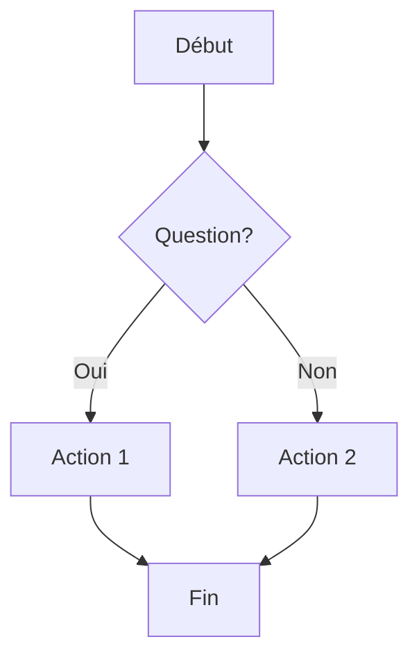
```mermaid
graph TD
    A[Début] --> B{Question?}
    B -->|Oui| C[Action 1]
    B -->|Non| D[Action 2]
    C --> E[Fin]
    D --> E
```
````

---

## 📊 Types de Diagrammes

### 🌐 Flowcharts (Organigrammes)

#### 📖 Description
Les flowcharts sont parfaits pour représenter des processus, des algorithmes ou des flux de décision.

#### 🎯 Cas d'usage
- Architecture applicative
- Processus de CI/CD
- Algorithmes
- Flux utilisateur

#### 📝 Template Basique
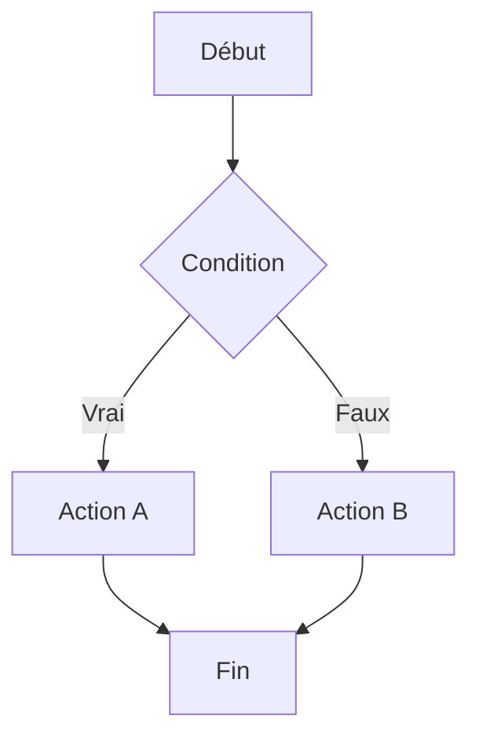
```mermaid
graph TD
    A[Début] --> B{Condition}
    B -->|Vrai| C[Action A]
    B -->|Faux| D[Action B]
    C --> E[Fin]
    D --> E
```

#### 🚀 Template Avancé - Architecture Microservices
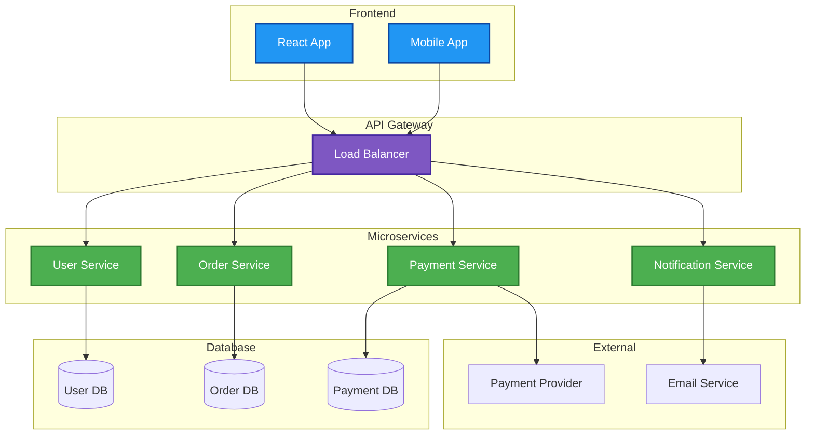
```mermaid
graph TB
    subgraph "Frontend"
        A[React App]
        B[Mobile App]
    end
    
    subgraph "API Gateway"
        C[Load Balancer]
    end
    
    subgraph "Microservices"
        D[User Service]
        E[Order Service]
        F[Payment Service]
        G[Notification Service]
    end
    
    subgraph "Database"
        H[(User DB)]
        I[(Order DB)]
        J[(Payment DB)]
    end
    
    subgraph "External"
        K[Payment Provider]
        L[Email Service]
    end
    
    A --> C
    B --> C
    C --> D
    C --> E
    C --> F
    C --> G
    
    D --> H
    E --> I
    F --> J
    F --> K
    G --> L
    
    style A fill:#2196f3,stroke:#0d47a1,color:#fff,stroke-width:2px
    style B fill:#2196f3,stroke:#0d47a1,color:#fff,stroke-width:2px
    style C fill:#7e57c2,stroke:#4527a0,color:#fff,stroke-width:2px
    style D fill:#4caf50,stroke:#2e7d32,color:#fff,stroke-width:2px
    style E fill:#4caf50,stroke:#2e7d32,color:#fff,stroke-width:2px
    style F fill:#4caf50,stroke:#2e7d32,color:#fff,stroke-width:2px
    style G fill:#4caf50,stroke:#2e7d32,color:#fff,stroke-width:2px
```

#### 🎨 Template - Processus de Développement
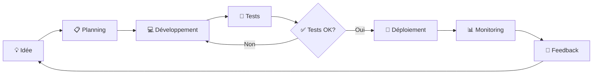
```mermaid
graph LR
    A[💡 Idée] --> B[📋 Planning]
    B --> C[💻 Développement]
    C --> D[🧪 Tests]
    D --> E{✅ Tests OK?}
    E -->|Non| C
    E -->|Oui| F[🚀 Déploiement]
    F --> G[📊 Monitoring]
    G --> H[🔄 Feedback]
    H --> A
```

### 📈 Graphiques

#### 📖 Description
Représentent des relations et connexions entre différents éléments.

#### 🎯 Template - Apprentissage Continu
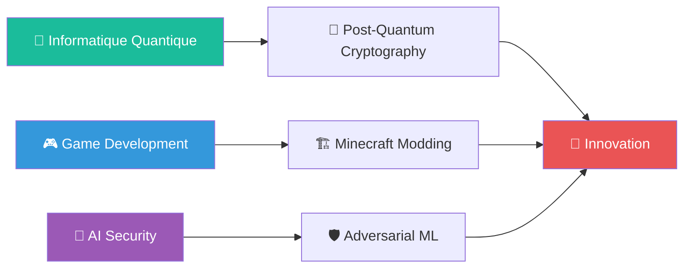
```mermaid
graph LR
    A[🔬 Informatique Quantique] --> B[🔐 Post-Quantum Cryptography]
    C[🎮 Game Development] --> D[🏗️ Minecraft Modding]
    E[🤖 AI Security] --> F[🛡️ Adversarial ML]
    B --> G[🚀 Innovation]
    D --> G
    F --> G

    style G fill:#EA5455,color:#fff
    style A fill:#1BBC9B,color:#fff
    style C fill:#3498DB,color:#fff
    style E fill:#9B59B6,color:#fff
```

#### 🌟 Template - Stack Technique
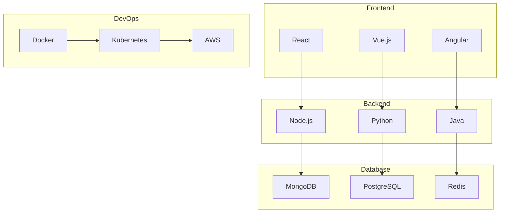
```mermaid
graph TB
    subgraph "Frontend"
        A[React]
        B[Vue.js]
        C[Angular]
    end
    
    subgraph "Backend"
        D[Node.js]
        E[Python]
        F[Java]
    end
    
    subgraph "Database"
        G[MongoDB]
        H[PostgreSQL]
        I[Redis]
    end
    
    subgraph "DevOps"
        J[Docker]
        K[Kubernetes]
        L[AWS]
    end
    
    A --> D
    B --> E
    C --> F
    D --> G
    E --> H
    F --> I
    J --> K
    K --> L
```

### 🗂️ Diagrammes de Séquence

#### 📖 Description
Montrent les interactions entre différents acteurs dans le temps.

#### 🎯 Template - Authentification Utilisateur
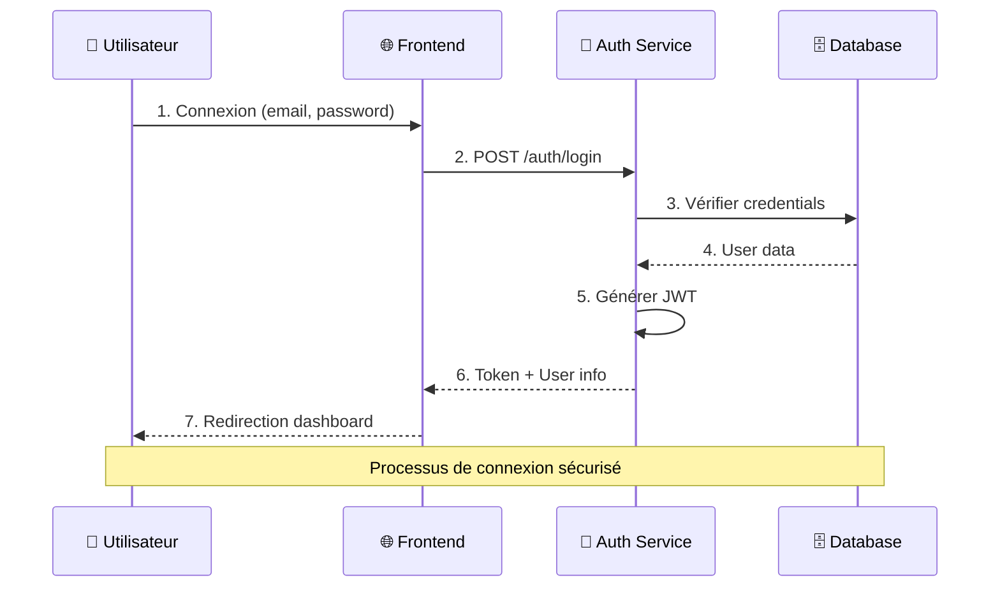
```mermaid
sequenceDiagram
    participant U as 👤 Utilisateur
    participant F as 🌐 Frontend
    participant A as 🔐 Auth Service
    participant D as 🗄️ Database
    
    U->>F: 1. Connexion (email, password)
    F->>A: 2. POST /auth/login
    A->>D: 3. Vérifier credentials
    D-->>A: 4. User data
    A->>A: 5. Générer JWT
    A-->>F: 6. Token + User info
    F-->>U: 7. Redirection dashboard
    
    Note over U,D: Processus de connexion sécurisé
```

#### 🔄 Template - CI/CD Pipeline
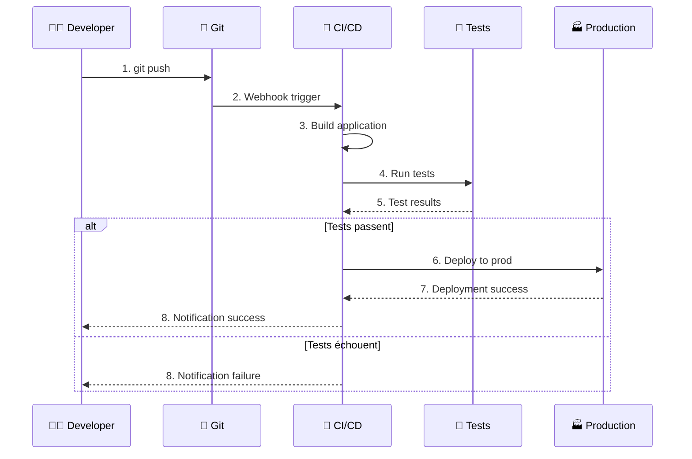
```mermaid
sequenceDiagram
    participant D as 👨‍💻 Developer
    participant G as 📁 Git
    participant CI as 🔧 CI/CD
    participant T as 🧪 Tests
    participant P as 🏭 Production
    
    D->>G: 1. git push
    G->>CI: 2. Webhook trigger
    CI->>CI: 3. Build application
    CI->>T: 4. Run tests
    T-->>CI: 5. Test results
    alt Tests passent
        CI->>P: 6. Deploy to prod
        P-->>CI: 7. Deployment success
        CI-->>D: 8. Notification success
    else Tests échouent
        CI-->>D: 8. Notification failure
    end
```

### 👥 Diagrammes de Classes

#### 📖 Description
Représentent la structure orientée objet d'un système.

#### 🎯 Template - Système E-commerce
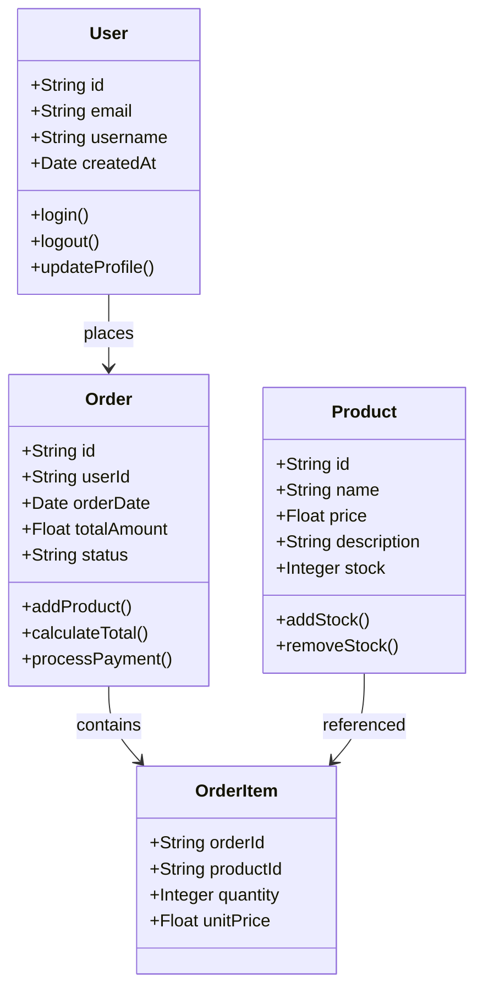
```mermaid
classDiagram
    class User {
        +String id
        +String email
        +String username
        +Date createdAt
        +login()
        +logout()
        +updateProfile()
    }
    
    class Product {
        +String id
        +String name
        +Float price
        +String description
        +Integer stock
        +addStock()
        +removeStock()
    }
    
    class Order {
        +String id
        +String userId
        +Date orderDate
        +Float totalAmount
        +String status
        +addProduct()
        +calculateTotal()
        +processPayment()
    }
    
    class OrderItem {
        +String orderId
        +String productId
        +Integer quantity
        +Float unitPrice
    }
    
    User --> Order : places
    Order --> OrderItem : contains
    Product --> OrderItem : referenced
```

### 🔄 Diagrammes d'État

#### 📖 Description
Montrent les différents états d'un objet et les transitions possibles.

#### 🎯 Template - Cycle de Vie d'une Commande
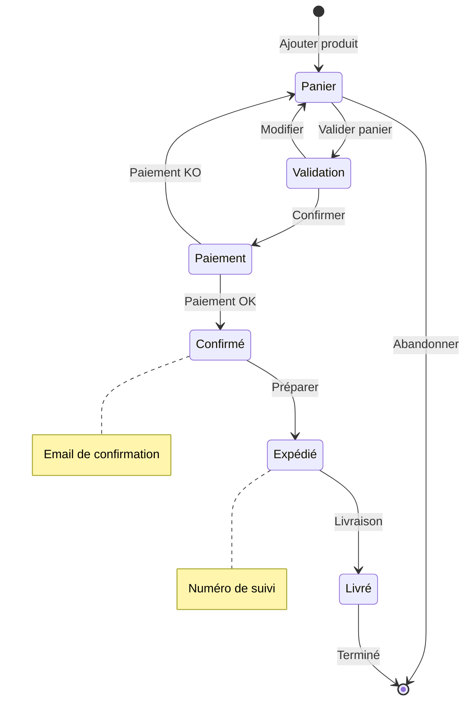
```mermaid
stateDiagram-v2
    [*] --> Panier : Ajouter produit
    Panier --> Validation : Valider panier
    Panier --> [*] : Abandonner
    
    Validation --> Paiement : Confirmer
    Validation --> Panier : Modifier
    
    Paiement --> Confirmé : Paiement OK
    Paiement --> Panier : Paiement KO
    
    Confirmé --> Expédié : Préparer
    Expédié --> Livré : Livraison
    Livré --> [*] : Terminé
    
    note right of Confirmé : Email de confirmation
    note right of Expédié : Numéro de suivi
```

#### 🔧 Template - États d'une Pull Request
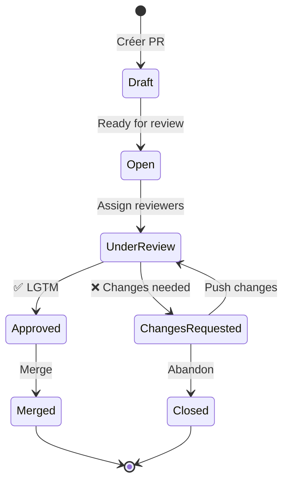
```mermaid
stateDiagram-v2
    [*] --> Draft : Créer PR
    Draft --> Open : Ready for review
    Open --> UnderReview : Assign reviewers
    
    UnderReview --> ChangesRequested : ❌ Changes needed
    UnderReview --> Approved : ✅ LGTM
    
    ChangesRequested --> UnderReview : Push changes
    ChangesRequested --> Closed : Abandon
    
    Approved --> Merged : Merge
    Merged --> [*]
    Closed --> [*]
```

### 🗓️ Diagrammes de Gantt

#### 📖 Description
Planification et suivi de projets dans le temps.

#### 🎯 Template - Développement d'Application
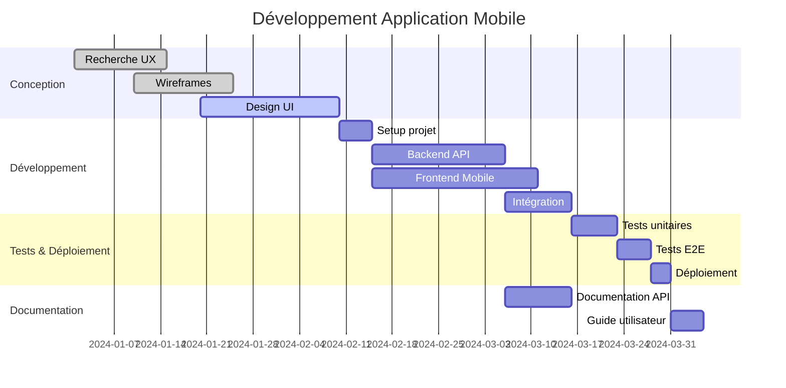
```mermaid
gantt
    title Développement Application Mobile
    dateFormat  YYYY-MM-DD
    section Conception
    Recherche UX          :done,    research, 2024-01-01, 2024-01-15
    Wireframes           :done,    wireframe, 2024-01-10, 2024-01-25
    Design UI            :active,  design, 2024-01-20, 2024-02-10
    
    section Développement
    Setup projet         :setup, after design, 5d
    Backend API          :backend, after setup, 20d
    Frontend Mobile      :frontend, after setup, 25d
    Intégration         :integration, after backend, 10d
    
    section Tests & Déploiement
    Tests unitaires     :testing, after integration, 7d
    Tests E2E           :e2e, after testing, 5d
    Déploiement         :deploy, after e2e, 3d
    
    section Documentation
    Documentation API   :docs, after backend, 10d
    Guide utilisateur   :guide, after deploy, 5d
```

### 🥧 Diagrammes en Secteurs

#### 📖 Description
Représentent des proportions et pourcentages.

#### 🎯 Template - Technologies Utilisées
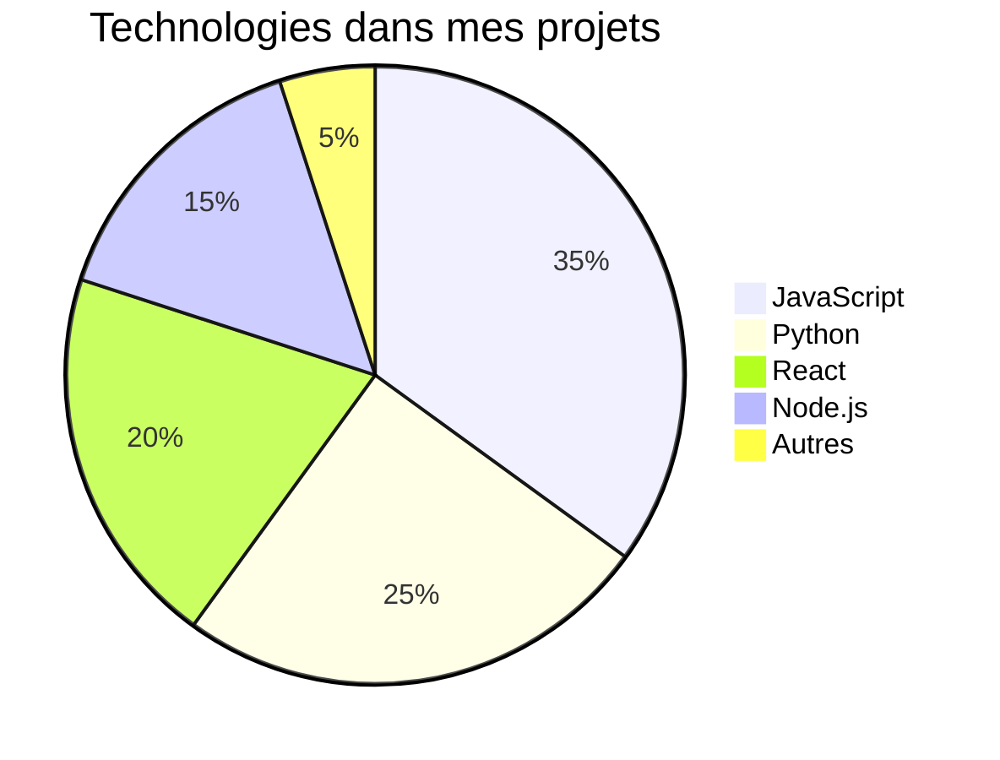
```mermaid
pie title Technologies dans mes projets
    "JavaScript" : 35
    "Python" : 25
    "React" : 20
    "Node.js" : 15
    "Autres" : 5
```

#### 📊 Template - Répartition du Temps
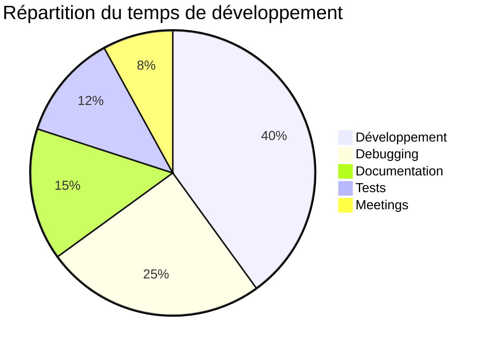
```mermaid
pie title Répartition du temps de développement
    "Développement" : 40
    "Debugging" : 25
    "Documentation" : 15
    "Tests" : 12
    "Meetings" : 8
```

### 🏛️ Diagrammes Entité-Relation

#### 📖 Description
Modélisation de bases de données relationnelles.

#### 🎯 Template - Blog System
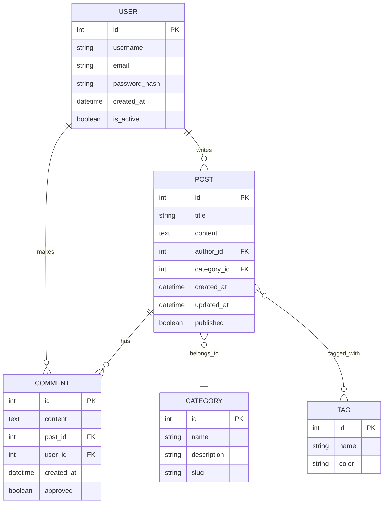
```mermaid
erDiagram
    USER ||--o{ POST : writes
    USER ||--o{ COMMENT : makes
    POST ||--o{ COMMENT : has
    POST }o--|| CATEGORY : belongs_to
    POST }o--o{ TAG : tagged_with
    
    USER {
        int id PK
        string username
        string email
        string password_hash
        datetime created_at
        boolean is_active
    }
    
    POST {
        int id PK
        string title
        text content
        int author_id FK
        int category_id FK
        datetime created_at
        datetime updated_at
        boolean published
    }
    
    COMMENT {
        int id PK
        text content
        int post_id FK
        int user_id FK
        datetime created_at
        boolean approved
    }
    
    CATEGORY {
        int id PK
        string name
        string description
        string slug
    }
    
    TAG {
        int id PK
        string name
        string color
    }
```

### 👤 User Journey

#### 📖 Description
Parcours et expérience utilisateur.

#### 🎯 Template - Parcours E-commerce
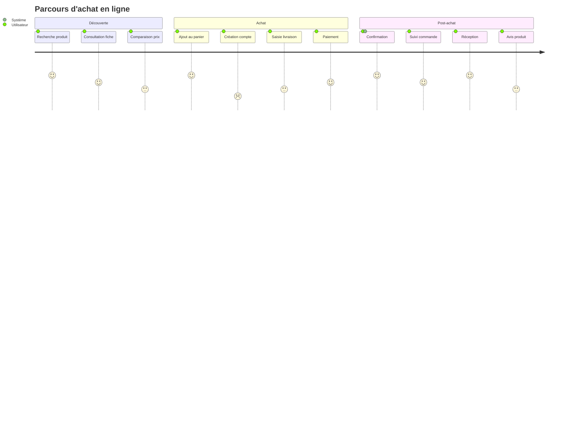
```mermaid
journey
    title Parcours d'achat en ligne
    section Découverte
      Recherche produit     : 5: Utilisateur
      Consultation fiche    : 4: Utilisateur
      Comparaison prix      : 3: Utilisateur
      
    section Achat
      Ajout au panier      : 5: Utilisateur
      Création compte      : 2: Utilisateur
      Saisie livraison     : 3: Utilisateur
      Paiement            : 4: Utilisateur
      
    section Post-achat
      Confirmation        : 5: Utilisateur, Système
      Suivi commande      : 4: Utilisateur
      Réception          : 5: Utilisateur
      Avis produit       : 3: Utilisateur
```

### 🔀 GitFlow

#### 📖 Description
Workflow Git et branches.

#### 🎯 Template - GitFlow Standard
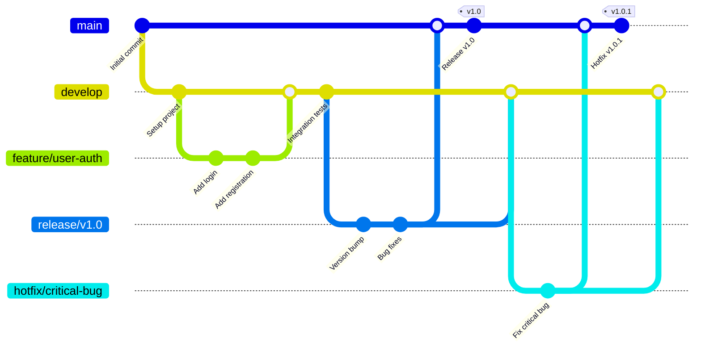
```mermaid
gitGraph
    commit id: "Initial commit"
    branch develop
    checkout develop
    commit id: "Setup project"
    
    branch feature/user-auth
    checkout feature/user-auth
    commit id: "Add login"
    commit id: "Add registration"
    
    checkout develop
    merge feature/user-auth
    commit id: "Integration tests"
    
    branch release/v1.0
    checkout release/v1.0
    commit id: "Version bump"
    commit id: "Bug fixes"
    
    checkout main
    merge release/v1.0
    commit id: "Release v1.0" tag: "v1.0"
    
    checkout develop
    merge release/v1.0
    
    branch hotfix/critical-bug
    checkout hotfix/critical-bug
    commit id: "Fix critical bug"
    
    checkout main
    merge hotfix/critical-bug
    commit id: "Hotfix v1.0.1" tag: "v1.0.1"
    
    checkout develop
    merge hotfix/critical-bug
```

---

## 🎨 Personnalisation

### 🌈 Couleurs et Styles

#### Classes CSS personnalisées
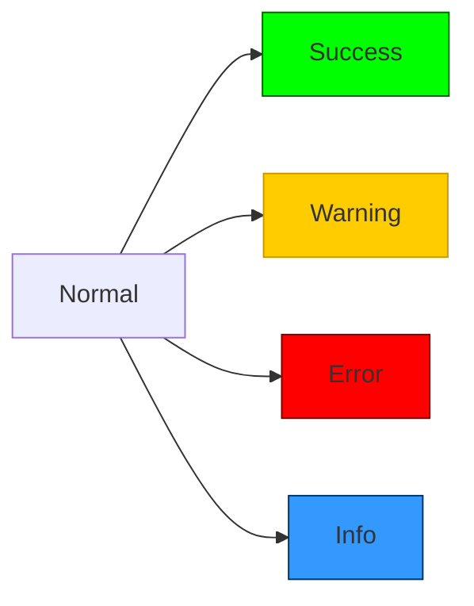
```mermaid
graph LR
    A[Normal] --> B[Success]
    A --> C[Warning]
    A --> D[Error]
    A --> E[Info]
    
    style B fill:#00ff00,stroke:#006600
    style C fill:#ffcc00,stroke:#cc9900
    style D fill:#ff0000,stroke:#800000
    style E fill:#3399ff,stroke:#003366
```

#### Thèmes disponibles
- `default` - Thème par défaut
- `dark` - Mode sombre
- `forest` - Tons verts
- `neutral` - Tons neutres

### 🎯 Sous-graphiques
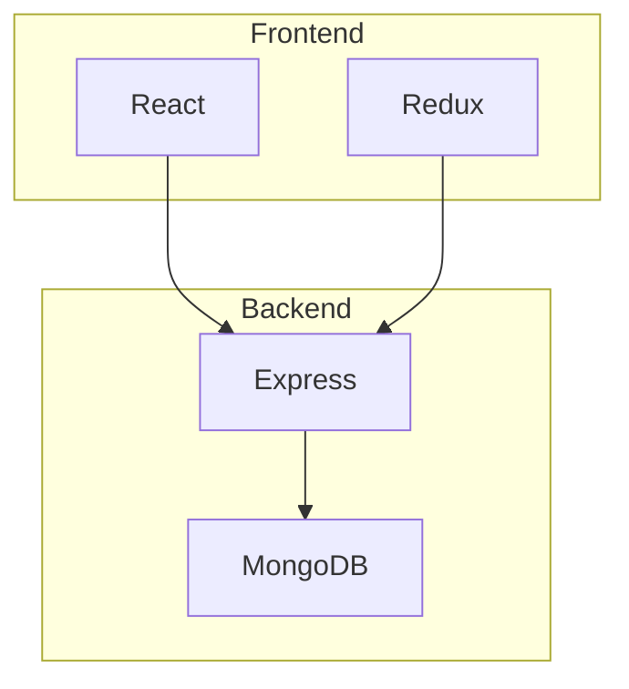
```mermaid
graph TB
    subgraph "Frontend"
        A[React]
        B[Redux]
    end
    
    subgraph "Backend"
        C[Express]
        D[MongoDB]
    end
    
    A --> C
    B --> C
    C --> D
```

---

## 📚 Templates par Profil

### 👨‍💻 Développeur Full-Stack
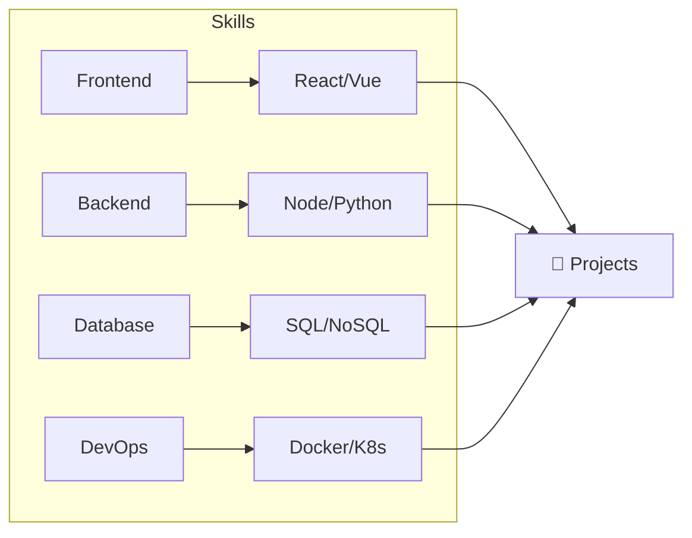
```mermaid
graph LR
    subgraph "Skills"
        A[Frontend] --> B[React/Vue]
        C[Backend] --> D[Node/Python]
        E[Database] --> F[SQL/NoSQL]
        G[DevOps] --> H[Docker/K8s]
    end
    
    B --> I[💼 Projects]
    D --> I
    F --> I
    H --> I
```

### 🔒 Cybersécurité
```mermaid
---
config:
  theme: neo
---
graph TD
    A[🔍 Reconnaissance] --> B[🎯 Scanning]
    B --> C[🚪 Enumeration]
    C --> D[⚡ Exploitation]
    D --> E[🏃 Post-Exploitation]
    E --> F[📊 Reporting]
    style A fill:#7aa2f7
    style D fill:#bb9af7
    style F fill:#9ece6a
```

### 📊 Data Scientist
```mermaid
graph LR
    A[📥 Data Collection] --> B[🧹 Data Cleaning]
    B --> C[🔍 EDA]
    C --> D[🤖 Model Training]
    D --> E[📈 Evaluation]
    E --> F[🚀 Deployment]
    
    F --> G[📊 Monitoring]
    G --> A
```

### 🎨 Designer UX/UI
```mermaid
journey
    title Processus de Design UX/UI
    section Recherche
      User Research        : 5: Designer
      Personas            : 4: Designer
      User Journey        : 5: Designer
      
    section Design
      Wireframes          : 4: Designer
      Prototypes          : 5: Designer
      Visual Design       : 5: Designer
      
    section Test
      User Testing        : 4: Designer, Users
      Itération          : 3: Designer
      Livraison          : 5: Designer, Dev
```

---

## 🛠️ Bonnes Pratiques

### ✅ À faire
- **Gardez vos diagrammes simples** - maximum 10-15 éléments
- **Utilisez des couleurs cohérentes** - définissez une palette
- **Ajoutez des descriptions** - expliquez le contexte
- **Testez le rendu** - vérifiez sur GitHub
- **Versionnez avec le code** - diagrammes = documentation

### ❌ À éviter
- Diagrammes trop complexes
- Trop de couleurs différentes
- Texte trop petit
- Liens cassés entre éléments
- Syntaxe incorrecte

### 🎯 Optimisation
```mermaid
graph LR
    A[📝 Simple] --> B[🎨 Cohérent]
    B --> C[📱 Responsive]
    C --> D[♿ Accessible]
    D --> E[⚡ Performant]
```

### 📐 Tailles recommandées
- **Flowcharts** : 5-12 nœuds
- **Séquences** : 3-6 participants
- **Classes** : 3-8 classes
- **Gantt** : 2-4 sections, 15-20 tâches max

---

## 🐛 Dépannage

### ❓ Problèmes fréquents

#### Le diagramme ne s'affiche pas
```markdown
<!-- ❌ Incorrect -->
´´´mermaid
graph TD
    A --> B
´´´

<!-- ✅ Correct -->
```mermaid
graph TD
    A --> B
```
```

#### Caractères spéciaux
```mermaid
graph LR
    A["Texte avec 'quotes'"] --> B["Texte avec (parenthèses)"]
    B --> C["Texte avec #hashtag"]
```

#### Flèches et connections
```mermaid
graph LR
    %% Différents types de flèches
    A --> B  %% Flèche normale
    C --- D  %% Ligne simple
    E -.-> F %% Flèche pointillée
    G ==> H  %% Flèche épaisse
```

### 🔧 Debug
1. **Vérifiez la syntaxe** - utilisez un éditeur Mermaid en ligne
2. **Testez par parties** - construisez progressivement
3. **Consultez la documentation** - [mermaid-js.github.io](https://mermaid-js.github.io/)
4. **Utilisez les commentaires** - `%% Ceci est un commentaire`

### 📋 Checklist finale
- [ ] Syntaxe Mermaid correcte
- [ ] Rendu correct sur GitHub
- [ ] Couleurs cohérentes
- [ ] Texte lisible
- [ ] Diagramme pertinent
- [ ] Documentation à jour

---

<div align="center">

### 🎉 Voilà ! Vous êtes maintenant prêt à créer des diagrammes professionnels !

[](https://mermaid-js.github.io/)
[](https://mermaid.live/)

*N'hésitez pas à expérimenter et à adapter ces templates à vos besoins !*

</div>
