# 🧩 Mermaid Diagrams - Templates & Guide

<div align="center">


*Transformez vos README avec des diagrammes visuels professionnels*

</div>

---

## 📋 Table des Matières

- [🎯 Introduction](#-introduction)
- [⚡ Quick Start](#-quick-start)
- [📊 Types de Diagrammes](#-types-de-diagrammes)
  - [🌐 Flowcharts (Organigrammes)](#-flowcharts-organigrammes)
  - [📈 Graphiques](#-graphiques)
  - [🗂️ Diagrammes de Séquence](#️-diagrammes-de-séquence)
  - [👥 Diagrammes de Classes](#-diagrammes-de-classes)
  - [🔄 Diagrammes d'État](#-diagrammes-détat)
  - [🗓️ Diagrammes de Gantt](#️-diagrammes-de-gantt)
  - [🥧 Diagrammes en Secteurs](#-diagrammes-en-secteurs)
  - [🏛️ Diagrammes Entité-Relation](#️-diagrammes-entité-relation)
  - [👤 User Journey](#-user-journey)
  - [🔀 GitFlow](#-gitflow)
- [🎨 Personnalisation](#-personnalisation)
- [📚 Templates par Profil](#-templates-par-profil)
- [🛠️ Bonnes Pratiques](#️-bonnes-pratiques)
- [🐛 Dépannage](#-dépannage)

---

## 🎯 Introduction

**Mermaid** est un outil puissant qui permet de créer des diagrammes directement dans du markdown. GitHub supporte nativement Mermaid, ce qui signifie que vos diagrammes s'affichent automatiquement dans vos README !

### ✅ Avantages
- **Intégration native** dans GitHub
- **Code as Documentation** - versionnable avec Git
- **Rendu automatique** - pas d'images à maintenir
- **Syntaxe simple** - facile à apprendre
- **Responsive** - s'adapte à tous les écrans

### 🎨 Cas d'usage courants
- Architecture de projet
- Workflow de développement
- Parcours utilisateur
- Planning de projet
- Modélisation de données
- Processus métier

---

## ⚡ Quick Start

Pour utiliser Mermaid dans votre README, utilisez cette syntaxe :

````markdown

```mermaid
graph TD
    A[Début] --> B{Question?}
    B -->|Oui| C[Action 1]
    B -->|Non| D[Action 2]
    C --> E[Fin]
    D --> E
```

````

---

## 📊 Types de Diagrammes

### 🌐 Flowcharts (Organigrammes)

#### 📖 Description
Les flowcharts sont parfaits pour représenter des processus, des algorithmes ou des flux de décision.

#### 🎯 Cas d'usage
- Architecture applicative
- Processus de CI/CD
- Algorithmes
- Flux utilisateur

#### 📝 Template Basique

```mermaid
graph TD
    A[Début] --> B{Condition}
    B -->|Vrai| C[Action A]
    B -->|Faux| D[Action B]
    C --> E[Fin]
    D --> E
```


#### 🚀 Template Avancé - Architecture Microservices


#### 🎨 Template - Processus de Développement

```mermaid
graph LR
    A[💡 Idée] --> B[📋 Planning]
    B --> C[💻 Développement]
    C --> D[🧪 Tests]
    D --> E{✅ Tests OK?}
    E -->|Non| C
    E -->|Oui| F[🚀 Déploiement]
    F --> G[📊 Monitoring]
    G --> H[🔄 Feedback]
    H --> A
```


### 📈 Graphiques

#### 📖 Description
Représentent des relations et connexions entre différents éléments.

#### 🎯 Template - Apprentissage Continu

```mermaid
graph LR
    A[🔬 Informatique Quantique] --> B[🔐 Post-Quantum Cryptography]
    C[🎮 Game Development] --> D[🏗️ Minecraft Modding]
    E[🤖 AI Security] --> F[🛡️ Adversarial ML]
    B --> G[🚀 Innovation]
    D --> G
    F --> G

    style G fill:#EA5455,color:#fff
    style A fill:#1BBC9B,color:#fff
    style C fill:#3498DB,color:#fff
    style E fill:#9B59B6,color:#fff
```


#### 🌟 Template - Stack Technique


### 🗂️ Diagrammes de Séquence

#### 📖 Description
Montrent les interactions entre différents acteurs dans le temps.

#### 🎯 Template - Authentification Utilisateur

```mermaid
sequenceDiagram
    participant U as 👤 Utilisateur
    participant F as 🌐 Frontend
    participant A as 🔐 Auth Service
    participant D as 🗄️ Database
    
    U->>F: 1. Connexion (email, password)
    F->>A: 2. POST /auth/login
    A->>D: 3. Vérifier credentials
    D-->>A: 4. User data
    A->>A: 5. Générer JWT
    A-->>F: 6. Token + User info
    F-->>U: 7. Redirection dashboard
    
    Note over U,D: Processus de connexion sécurisé
```


#### 🔄 Template - CI/CD Pipeline

```mermaid
sequenceDiagram
    participant D as 👨‍💻 Developer
    participant G as 📁 Git
    participant CI as 🔧 CI/CD
    participant T as 🧪 Tests
    participant P as 🏭 Production
    
    D->>G: 1. git push
    G->>CI: 2. Webhook trigger
    CI->>CI: 3. Build application
    CI->>T: 4. Run tests
    T-->>CI: 5. Test results
    alt Tests passent
        CI->>P: 6. Deploy to prod
        P-->>CI: 7. Deployment success
        CI-->>D: 8. Notification success
    else Tests échouent
        CI-->>D: 8. Notification failure
    end
```


### 👥 Diagrammes de Classes

#### 📖 Description
Représentent la structure orientée objet d'un système.

#### 🎯 Template - Système E-commerce


### 🔄 Diagrammes d'État

#### 📖 Description
Montrent les différents états d'un objet et les transitions possibles.

#### 🎯 Template - Cycle de Vie d'une Commande


#### 🔧 Template - États d'une Pull Request

```mermaid
stateDiagram-v2
    [*] --> Draft : Créer PR
    Draft --> Open : Ready for review
    Open --> UnderReview : Assign reviewers
    
    UnderReview --> ChangesRequested : ❌ Changes needed
    UnderReview --> Approved : ✅ LGTM
    
    ChangesRequested --> UnderReview : Push changes
    ChangesRequested --> Closed : Abandon
    
    Approved --> Merged : Merge
    Merged --> [*]
    Closed --> [*]
```


### 🗓️ Diagrammes de Gantt

#### 📖 Description
Planification et suivi de projets dans le temps.

#### 🎯 Template - Développement d'Application


### 🥧 Diagrammes en Secteurs

#### 📖 Description
Représentent des proportions et pourcentages.

#### 🎯 Template - Technologies Utilisées


#### 📊 Template - Répartition du Temps

```mermaid
pie title Répartition du temps de développement
    "Développement" : 40
    "Debugging" : 25
    "Documentation" : 15
    "Tests" : 12
    "Meetings" : 8
```


### 🏛️ Diagrammes Entité-Relation

#### 📖 Description
Modélisation de bases de données relationnelles.

#### 🎯 Template - Blog System


### 👤 User Journey

#### 📖 Description
Parcours et expérience utilisateur.

#### 🎯 Template - Parcours E-commerce


### 🔀 GitFlow

#### 📖 Description
Workflow Git et branches.

#### 🎯 Template - GitFlow Standard


---

## 🎨 Personnalisation

### 🌈 Couleurs et Styles

#### Classes CSS personnalisées


#### Thèmes disponibles
- `default` - Thème par défaut
- `dark` - Mode sombre
- `forest` - Tons verts
- `neutral` - Tons neutres

### 🎯 Sous-graphiques


---

## 📚 Templates par Profil

### 👨‍💻 Développeur Full-Stack

```mermaid
graph LR
    subgraph "Skills"
        A[Frontend] --> B[React/Vue]
        C[Backend] --> D[Node/Python]
        E[Database] --> F[SQL/NoSQL]
        G[DevOps] --> H[Docker/K8s]
    end
    
    B --> I[💼 Projects]
    D --> I
    F --> I
    H --> I
```


### 🔒 Cybersécurité
```mermaid
---
config:
  theme: neo
---
graph TD
    A[🔍 Reconnaissance] --> B[🎯 Scanning]
    B --> C[🚪 Enumeration]
    C --> D[⚡ Exploitation]
    D --> E[🏃 Post-Exploitation]
    E --> F[📊 Reporting]
    style A fill:#7aa2f7
    style D fill:#bb9af7
    style F fill:#9ece6a
```

### 📊 Data Scientist
```mermaid
graph LR
    A[📥 Data Collection] --> B[🧹 Data Cleaning]
    B --> C[🔍 EDA]
    C --> D[🤖 Model Training]
    D --> E[📈 Evaluation]
    E --> F[🚀 Deployment]
    
    F --> G[📊 Monitoring]
    G --> A
```

### 🎨 Designer UX/UI
```mermaid
journey
    title Processus de Design UX/UI
    section Recherche
      User Research        : 5: Designer
      Personas            : 4: Designer
      User Journey        : 5: Designer
      
    section Design
      Wireframes          : 4: Designer
      Prototypes          : 5: Designer
      Visual Design       : 5: Designer
      
    section Test
      User Testing        : 4: Designer, Users
      Itération          : 3: Designer
      Livraison          : 5: Designer, Dev
```

---

## 🛠️ Bonnes Pratiques

### ✅ À faire
- **Gardez vos diagrammes simples** - maximum 10-15 éléments
- **Utilisez des couleurs cohérentes** - définissez une palette
- **Ajoutez des descriptions** - expliquez le contexte
- **Testez le rendu** - vérifiez sur GitHub
- **Versionnez avec le code** - diagrammes = documentation

### ❌ À éviter
- Diagrammes trop complexes
- Trop de couleurs différentes
- Texte trop petit
- Liens cassés entre éléments
- Syntaxe incorrecte

### 🎯 Optimisation
```mermaid
graph LR
    A[📝 Simple] --> B[🎨 Cohérent]
    B --> C[📱 Responsive]
    C --> D[♿ Accessible]
    D --> E[⚡ Performant]
```

### 📐 Tailles recommandées
- **Flowcharts** : 5-12 nœuds
- **Séquences** : 3-6 participants
- **Classes** : 3-8 classes
- **Gantt** : 2-4 sections, 15-20 tâches max

---

## 🐛 Dépannage

### ❓ Problèmes fréquents

#### Le diagramme ne s'affiche pas
```markdown
<!-- ❌ Incorrect -->
´´´mermaid
graph TD
    A --> B
´´´

<!-- ✅ Correct -->
```mermaid
graph TD
    A --> B
```
```

#### Caractères spéciaux
```mermaid
graph LR
    A["Texte avec 'quotes'"] --> B["Texte avec (parenthèses)"]
    B --> C["Texte avec #hashtag"]
```

#### Flèches et connections
```mermaid
graph LR
    %% Différents types de flèches
    A --> B  %% Flèche normale
    C --- D  %% Ligne simple
    E -.-> F %% Flèche pointillée
    G ==> H  %% Flèche épaisse
```

### 🔧 Debug
1. **Vérifiez la syntaxe** - utilisez un éditeur Mermaid en ligne
2. **Testez par parties** - construisez progressivement
3. **Consultez la documentation** - [mermaid-js.github.io](https://mermaid-js.github.io/)
4. **Utilisez les commentaires** - `%% Ceci est un commentaire`

### 📋 Checklist finale
- [ ] Syntaxe Mermaid correcte
- [ ] Rendu correct sur GitHub
- [ ] Couleurs cohérentes
- [ ] Texte lisible
- [ ] Diagramme pertinent
- [ ] Documentation à jour

---

<div align="center">

### 🎉 Voilà ! Vous êtes maintenant prêt à créer des diagrammes professionnels !

[](https://mermaid-js.github.io/)
[](https://mermaid.live/)

*N'hésitez pas à expérimenter et à adapter ces templates à vos besoins !*

</div>
